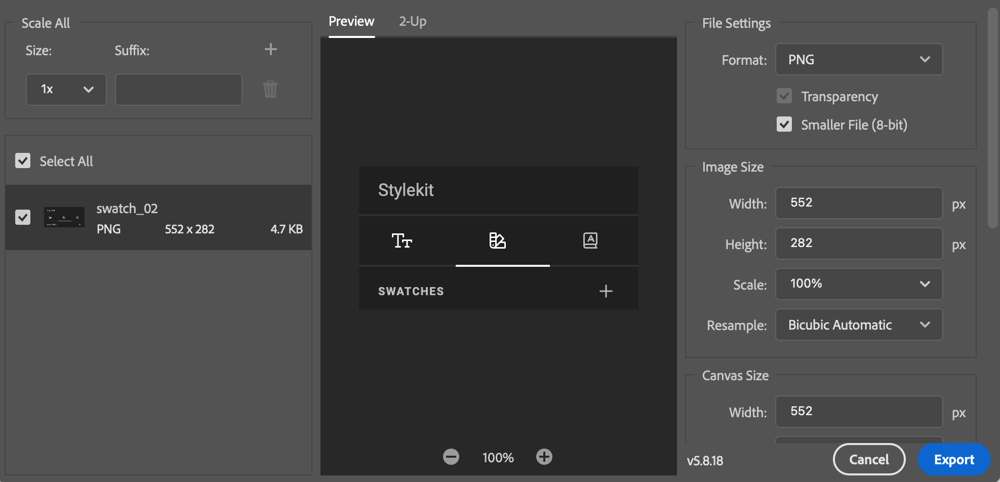
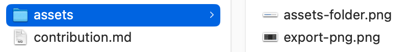

# Contributing

We're thrilled that you'd like to contribute to the CHILI GraFx documentation.
Your help is greatly appreciated.

Please note that this project is released with a Contributor Code of Conduct. By participating in this project you agree to abide by its terms.

## Submitting a pull request

1. [Fork](https://github.com/chili-publish/grafx-documentation/fork) and clone this repository
2. Create a new branch: `git checkout -b my-branch-name` \*
3. Make sure your changes pass a spell check (US English)
4. Build the project locally and run local tests
5. Push to your fork and [submit a pull request](https://github.com/chili-publish/editor-sdk/compare)
6. Pat yourself on the back and wait for your pull request to be reviewed and get merged

**my-branch-name**: We use the prefixes **fix**, **feature**, **solution** in our branches to indicate what they represent. 

An example for a branch that fixes a typo in Animation could be `fix/animation-typos`.

Other examples

- fix/grafx-myprojects-add-howto-rename (fixes an existing description)
- feature/grafxstudio-add-howto-output-movie (add non-existant description)
- solution/real-estate-multi-channel-output (adds solution description)
- fix/solution-realestate-typos (fixes the typos in previous solution)

## Use of assets

As a picture tells a thousand words, you can add pictures (assets) to the repository.

Add them to the folder **assets** of the same directory of your markdown file.

- Location: [markdown-file-directory/assets]
- Naming: Be concise but descriptive e.g. [.../assets/screenshot-grafx-myprojects-new.png]
- No spaces in asset names
- Lowercase asset names
- Keep size below 1920 pixels wide and 1920 pixels high. (this allows for use in HD video content and keeps the size modarate).
- Absolute file size maximum: 3MB (aim at 512kB)
- Crop where possible

Example export for a PNG file

This file is stored in the "assets" folder, next to the contribution.md file.

## Acceptance criteria

Things to take into account:

-	Spell check to US English (e.g. color vs colour)
-   Execute tests (does Mkdocs build properly, do all extensions work)
-   Keep your change small. Non-dependent changes are separate pull requests.
-   Write [good commit messages](http://tbaggery.com/2008/04/19/a-note-about-git-commit-messages.html).
-   Prefix the title with [Fix], [Feature] or [solution] to describe what the scope is
-	API references are auto generated. Changes will be disregarded, please add an issue.

## Resources

-   [How to Contribute to Open Source](https://opensource.guide/how-to-contribute/)
-   [Using Pull Requests](https://help.github.com/articles/about-pull-requests/)
-   [GitHub Help](https://help.github.com/)