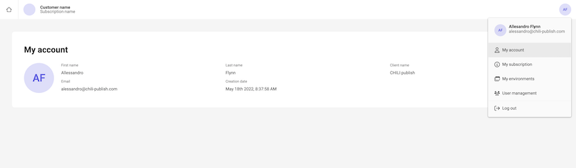
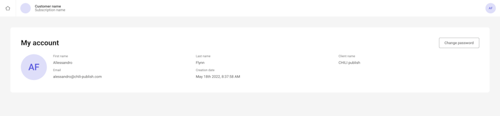
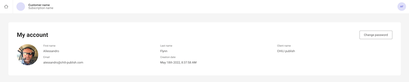

# CHILI GraFx platform administration

Account & Platform administration can be found under the dropdown in the icon on the top right.

## My account

### View account details

The central place to see and update your account details.

Click on the avatar to choose a new picture for your account

### Reset my password

You would only need to reset your password, if it got compromised.

Password have a lifecycle of 1 year, after that you'll be invited to create a new password.

## Subscriptions

[See: Subscriptions](/CHILI-GraFx/concepts/subscriptions/)

## Environments

[See: Environments](/CHILI-GraFx/concepts/environments/)

## User Management

[See User management](/CHILI-GraFx/users/intro/)