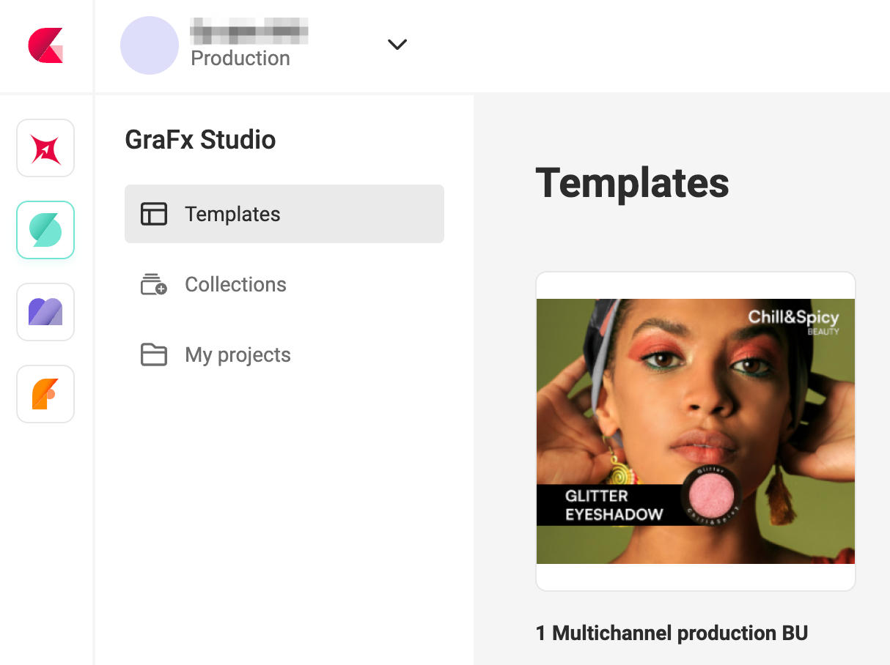

# Environments in CHILI GraFx

## Introduction

In CHILI GraFx, an environment is a foundational concept that shapes how users interact with and manage their creative assets. Environments act as segregated, secure spaces where documents, templates, and other creative elements are stored and managed.

## Key Characteristics of Environments

### Applications

All applications on the CHILI GraFx platform **live inside** the environments.

This means, you first will need to select an environment, before you can start an application, and start working on your Smart Templates.

When entering the platform, you don't see the applications, before you choose an Environment.

Choose an environment

Once in the environment, you can select the application you want to work in.

The dropdown at the top will show all visible environments for you.

Or you could click on the CHILI GraFx logo, to return to the platform home.

### Environment Settings Access

Environment-specific settings are available at the environment level.
Environment Admins and Subscription Admins (see [roles](/CHILI-GraFx/users/roles/#roles)) can access these settings via the gear icon in the left navigation (bottom).

{.screenshot-full}

These settings apply only to the selected environment and do not affect other environments.

The settings are also available in the environment overview.

{.screenshot-full}

### Isolation

One of the crucial features of an environment is its isolation from others. No data interchange or interaction is possible between different environments[^1]. This isolation ensures the security and integrity of data, where each environment functions independently.

### Sandbox vs. Production Environments

CHILI GraFx offers two primary types of environments – the Sandbox and the Production environment. See [here](/CHILI-GraFx/concepts/sandbox/) for more info.

### Testing and Deployment

The existence of separate Sandbox and Production environments allows for thorough testing of new features. This process is crucial to identify and fix any issues before they impact the live version used by customers.

### User Interface and API

Both the user interface (UI) and the application programming interface (API) of CHILI GraFx are subject to this environmental split.

Each environment has a technical name, which can be copied directly from Environment Settings.
This name is commonly used in integrations, API calls, and configuration.

{.screenshot-full}

### Hosting and Control

CHILI GraFx environments can be hosted on multi-tenant or private tenant setups, depending on the contract. This aspect determines the control you have over the timing of updates in both Sandbox and Production environments.

[^1]: Using the API you could build a workflow, interacting with several environments, considering you have access to all environments. Through API calls, could access assets on different environments.
