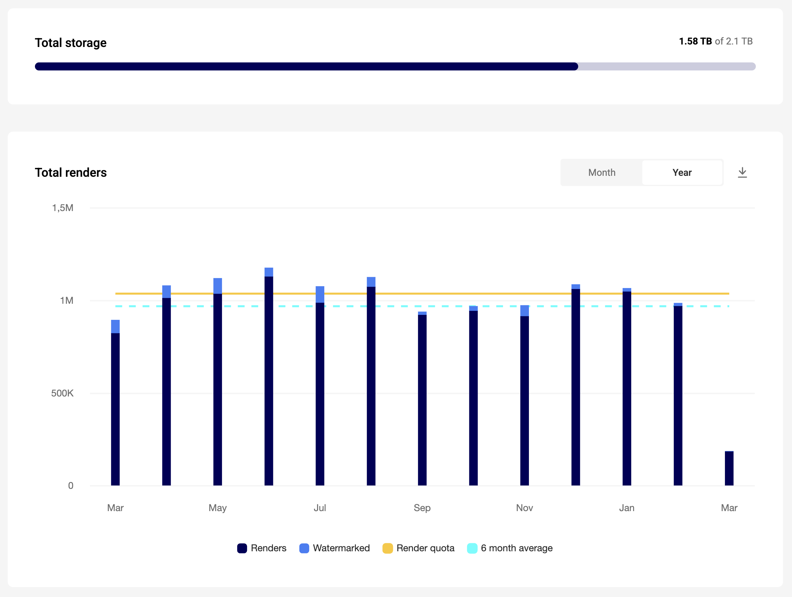
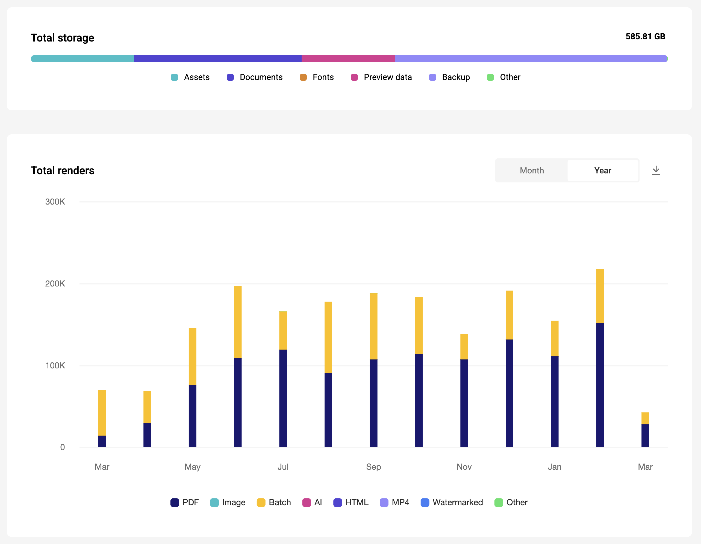

# Renders

A render is a measurement for the usage on the CHILI GraFx platform.

## Local vs Server

A lot of calculation is done on the client side, or local.

E.g. movement of frames, showing the animation, etc...

## Output

To generate output, server routines are necessary.

When these routines are called, a render is counted. Depending on the type of output, more or less renders are counted towards the average.

This average is used to size your allowance in your subscription.

## Examples

### Static Digital Output

1 render is counted for each Static Digital Image output generation

### Animated Digital Output

Basic concept: 1 render is counted towards each (started) second of output.

CHILI GraFx looks at the length of the animation. Not at the output framerate or whether or not only part of the clip or the whole clip is animated.

!!! Note
	**Some examples**
	
	- An animation with a duration of 0.1 seconds: 1 render
	- An animation with a duration of 0.5 seconds: 1 render
	- An animation with a duration of 1.5 seconds: 2 render
	- An animation with a duration of 2 seconds: 2 renders
	- An animation with a duration of 2,5 seconds: 3 renders
	- An animation with a duration of 3 seconds: 3 renders

Watermarked output does not count as a render.

### Static PDF output

1 render is counted towards each PDF file.

### Static PDF output with variable data (datasource)

When variable output is used, this is the formula to count renders.

The first 50 renders are counted individually, then each subsequent set of 10 add 1 render[^1].

[^1]: 1/10 is the default. Depending on your contract, the number might be different.

!!! Formula

	**V** = Variable Data source size (e.g. 1000 records)

	**Renders** = 50 + (V-50)/10

	In this case: 50 + (1000-50)/10 = 50 + 95 = 145

## Fair use policy

In your subscription, you're entitled to a render quota.

Your dashboard will show the actual status of renders for the full subsciption (all environments, with a delay of ±1 day).

The light blue line shows the "rolling average".

!!! info "Rolling average"

    Depending on your contract, the rolling average calculation might differ in amount of months taken into the calculation.

---

When you select an environment, you'll see the details.

Render quota are not a hard limit per month. If you generate more output than the render quota, we won’t block or watermark the output.

When the rolling average exceeds the render quota, you will be invoiced an extra render pack to increase your render quota to at least the average.
	
## Frequently Asked

### How do you calculate my usage?

We take your **contractual** rolling average and compare to quota.

!!! Average calculation

	E.g. 6 months rolling average calculation: Total of past 183 days divided by 6
	
	E.g. 3 months rolling average calculation: Total of past 92 days divided by 3

### What if I need a temporary burst?

There is no hard limit, so you can always burst to much higher than your quota.

If the rolling average remains below the contract, nothing will change. 

When the rolling average exceeds the render quota, you will be invoiced an extra render pack to increase your render quota to at least the average.