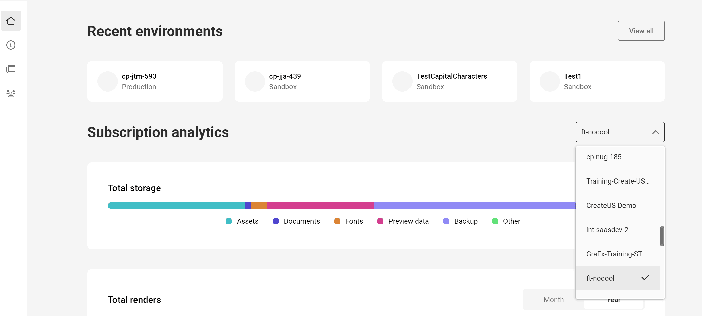
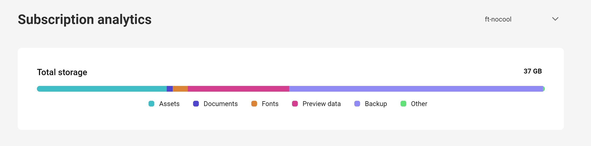

# Understanding Storage Calculation

This document outlines how your documents and assets, such as pictures, consume storage space in CHILI GraFx.

## Dashboard
Your journey in understanding storage starts on the Dashboard of [CHILI GraFx](https://chiligrafx.com). Here, a graph neatly displays the total storage used across all your environments.

You have the option to delve into specific environments using a dropdown selector.

In each environment, storage usage is broken down into several categories:
- Media assets (images you upload)
- Font assets
- Smart Templates
- Storage for preview files
- Storage for backups

!!! note

    This data is not in real-time and it can take up to two weeks for data changes to be reflected.

## Understanding Storage Dynamics

### Uploading Assets
When you upload an asset, such as to GraFx Media, it consumes storage equivalent to its file size. For instance, uploading a 1 MB image will use 1 MB of your storage quota.

### Uploading Fonts
Similar to an asset, when you upload a font, such as to GraFx Fonts, it occupies a certain amount of storage space. GraFx Fonts only allows you to upload one copy of each font style per font family. GraFx Publisher allows you to upload multiple copies, but it is advisable to avoid doing so to conserve storage space.

### Documents (Smart Templates)
Creating a document (GraFx Studio Templates, GraFx Studio Projects, or GraFx Publisher Documents) also uses storage. These files are typically small, under 400 KB, but larger and more complex templates will occupy more space.

### Preview Data
Our system automatically generates preview data for media assets and documents to enhance performance. These previews are required for the usage of assets in GraFx Studio and GraFx Publisher, ensuring quicker load times and smoother access. The size varies based on the original file, but each uploaded asset typically results in three generated previews:
    - High preview
    - Medium preview
    - 4k preview

### Backup Storage
Data security is paramount for us ([ISO 27001](https://www.chili-publish.com/trust/)). Therefore, CHILI GraFx creates backups of your uploaded media assets, fonts and documents. These backups are essential to protect your data against accidental loss or corruption. However, like preview files, backups also take up additional storage space. Typically, backups are a 1:1 ratio to the original file sizes.

## Scenario
Consider this example: you have Documents, Assets, and Fonts with their respective sizes. 

Backups are exact duplicates of your data, and their size might vary in real-world scenarios. CHILI GraFx always considers 100% of the data size for backup calculations. Note that preview data, crucial for system performance, is not included in backups. In a recovery situation, the CHILI GraFx engine will regenerate this data.

In this example, **333.9 GB** is the total storage displayed in your overview.

| Type of Data  | Size   | Backup Size   | Total |
| ----------- 	| -----: | -----: | --: |
| Documents     | 500 MB  | 500 MB  | 1.0 GB |
| Assets        | 100.0 GB | 100.0 GB | 200.0 GB |
| Fonts         | 200 MB   | 200 MB  | 400 MB |
| Preview data  | 132.5 GB  | n.a. | 132.5 GB |
| Total  		| **233.2 GB**  | **100.7 GB** | **333.9 GB** |

## Conclusion
Understanding how storage is calculated helps you manage your account effectively. The total storage footprint encompasses not only your uploaded files but also the additional space needed for previews, fonts, templates, and backups, balancing performance with data security.

If you're integrating CHILI GraFx into your workflow, developing a strategy for regular cleanup of old assets and templates is advisable for optimal storage management.