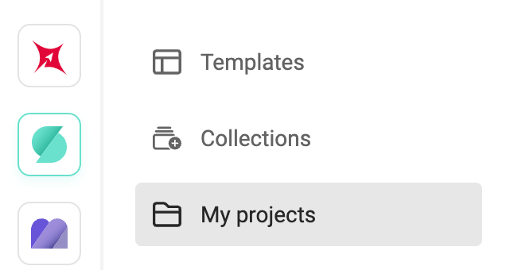
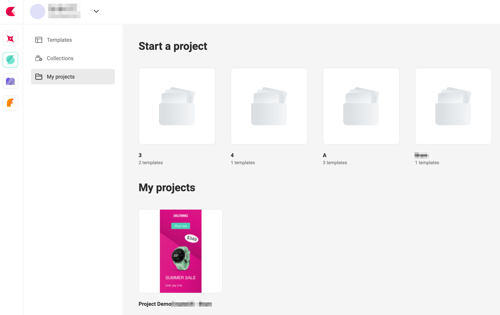
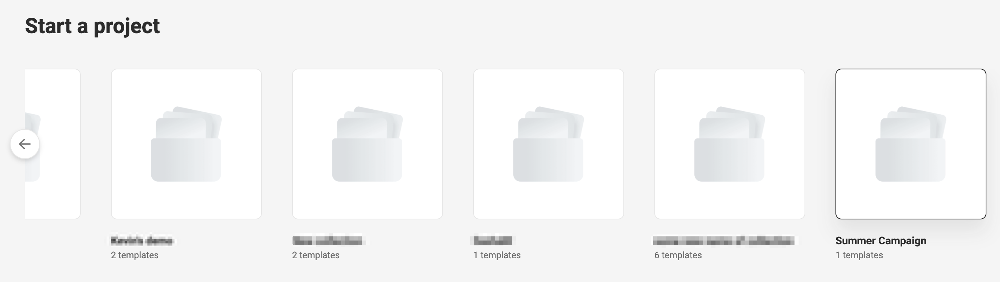
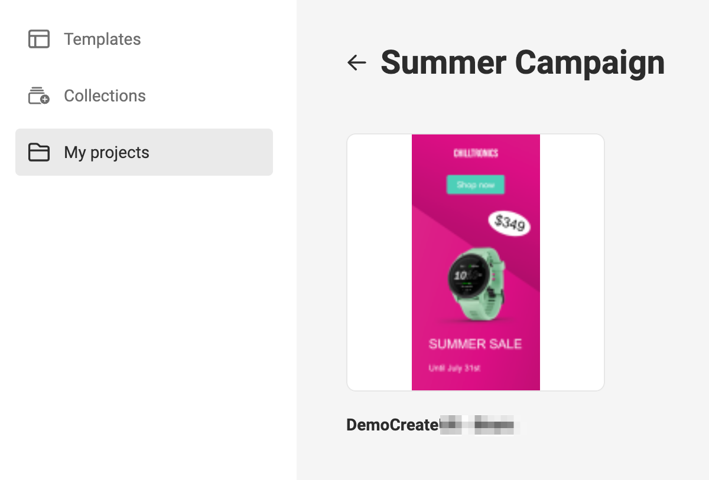
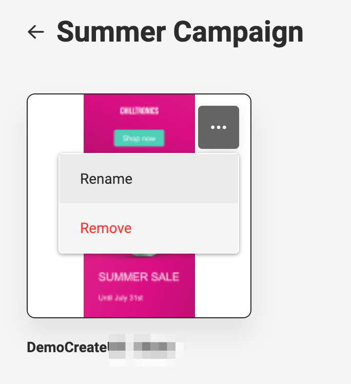
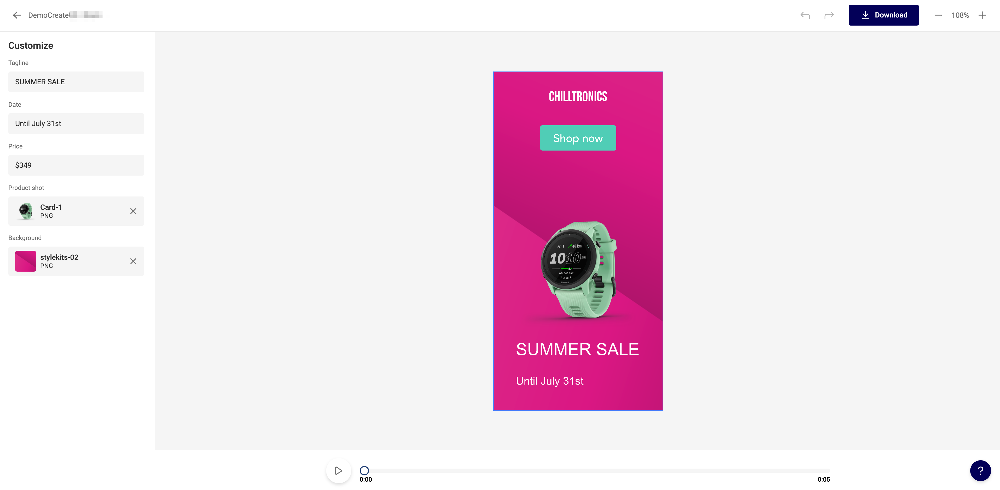
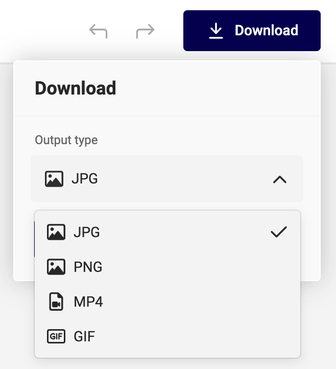

# My projects

See also: [Template Management](/CHILI-GraFx/concepts/template-management/#my-projects) for the full story.

## Before you start

Navigate to your environment, click "GraFx Studio" and click "My projects".

You will see "Start a project" and below "My projects"

If your template designer did not assign templates to a collection, or no collections exist yet, this page will be empty.

Before you start [you need to have 1 collection](/CHILI-GraFx/guides/manage-collections/#create-a-collection), with at least 1 Smart Template

## Pick a collection

Click a collection to see the templates in the collection

## Pick a template

Clicking on the template, will make a copy as "My Project" to enable you (end-user) to customize the template.

If you hover over the preview, a "..." menu will appear. This allows you to remove the template from the collection, or to rename the template. (Only Template Designers are allowed to do this).

## Customize your project

After choosing the template in the collection, the Studio UI will open. This is the End-User Interface to allow customization of a project.

Use the form on the left to customize. What fields are available, is defined by the Template designer

Return to the overview with the left arrow. (top left)

Download the asset in a pre-defined output format.

Preview the animation with the play button (if an animation is available).
