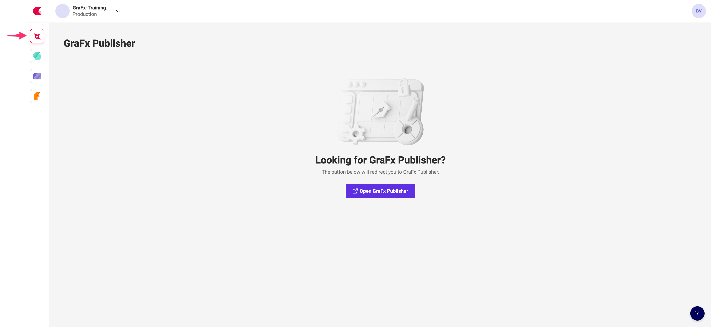

# Create a new GraFx Publisher template

!!! Info
	You need a [Template Designer Seat](../../../CHILI-GraFx/users/template-designer/) or a 
	[Content Administrator](../../../CHILI-GraFx/users/roles/#content-administrator) role to make templates in GraFx Publisher.

Navigate to GraFx Publisher, and [create your document in the Backoffice](https://chilipublishdocs.atlassian.net/wiki/spaces/CPDOC/pages/1413931/Creating+your+first+document){target=_blank}.

