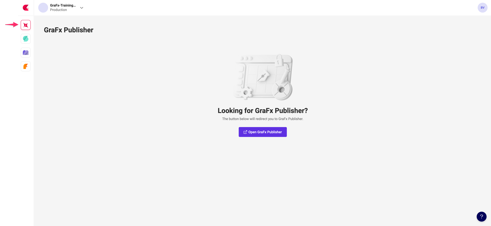

# Create a new GraFx Publisher template

!!! Info
	In our current phase of development, all Subscription Admins can create templates.
	When GraFx Studio moves into Phase 4, you will need a Template Designer Seat

Navigate to GraFx Publisher, and [create your document in the Backoffice](https://chilipublishdocs.atlassian.net/wiki/search?text=create%20first%20document){target=_blank}.

{.screenshot-full}
