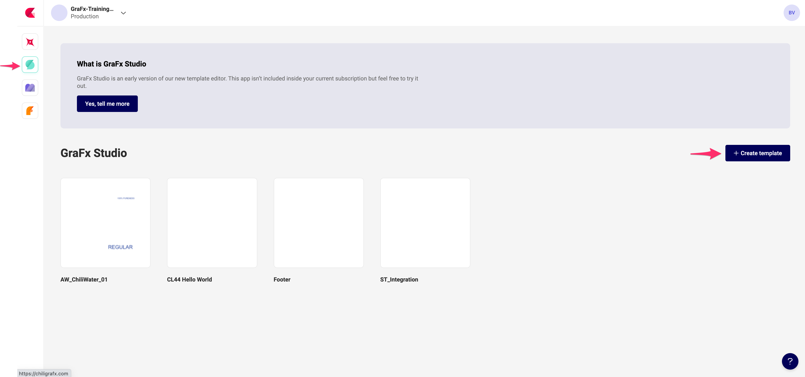
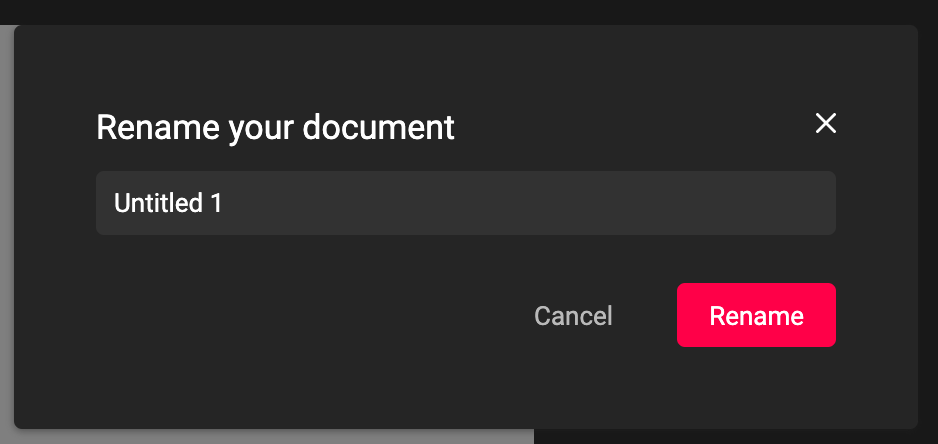
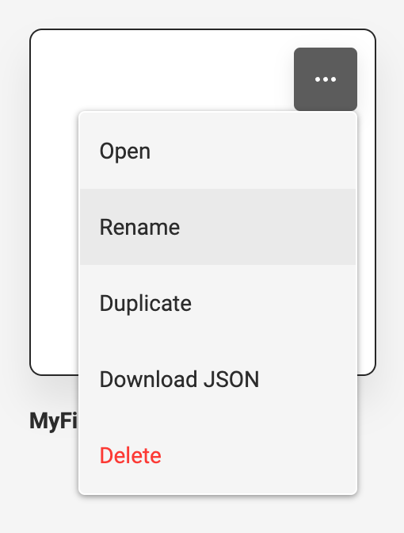

# Create a new GraFx Studio template

Navigate to GraFx Studio, and click the "+ Create template" buttons.

You can now create your smart template, and save  it.

To (re)name the file, you can do so in GraFx Studio, or in the template overview of CHILI GraFx.

## Rename in GraFx Studio

Click on the name on top of the screen.

## Rename in CHILI GraFx

Click the three dots, and choose "rename"

