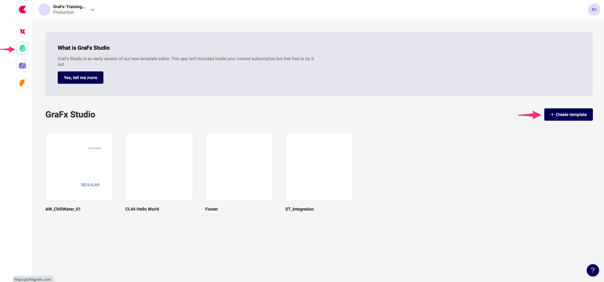
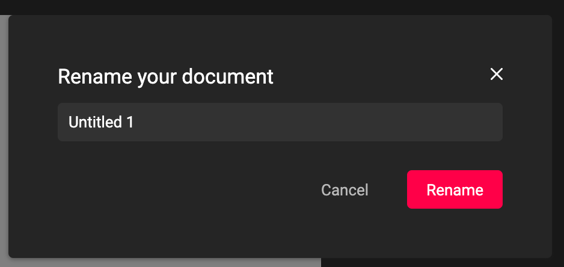
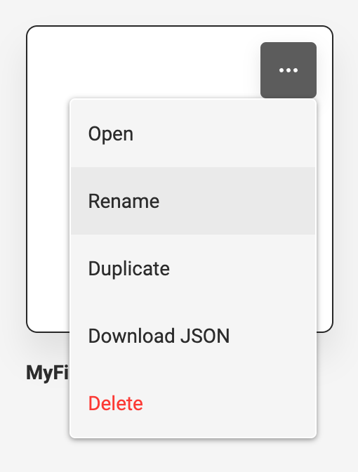

# Create a new GraFx Studio template

!!! Info
	In this phase, all Subscription Admins can create templates.
	When GraFx Studio moves into Phase 4, you will need a Template Designer Seat

Navigate to GraFx Studio, and click the "+ Create template" buttons.

{.screenshot-full}

An untitled file will be created, and GraFx Studio will open with the "Untitled" file.

You can now create your smart template, and save  it.

To (re)name the file, you can do so in GraFx Studio, or in the template overview of CHILI GraFx.

## Rename in GraFx Studio

Click on the name on top of the screen.

{.screenshot}

## Rename in CHILI GraFx

Click the three dots, and choose "rename"

{.screenshot}