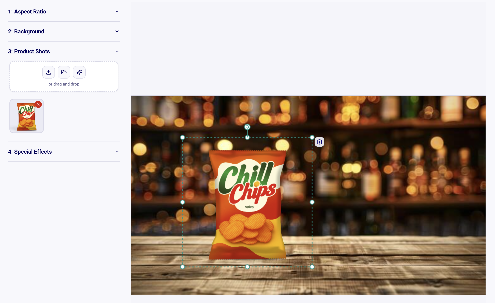
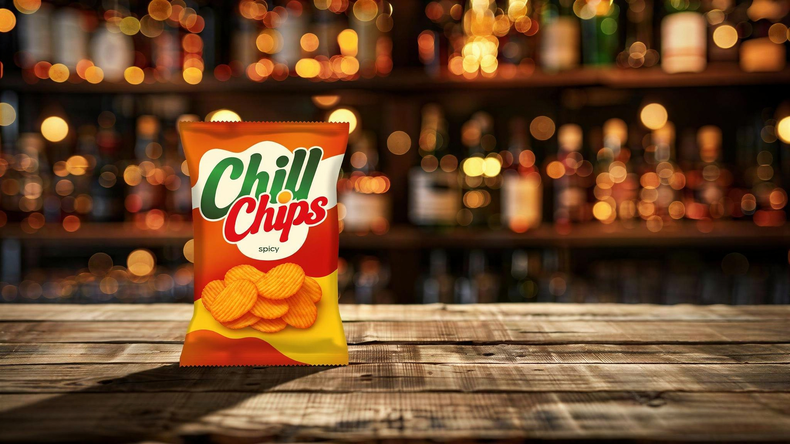

# GraFx Genie Product Image Composer

!!! example "Experimental feature"
      
    This capability is part of GraFx Labs and is experimental.  
    It can change or be removed at any time.  
    We look forward for your validation and feedback.
    
**GraFx Genie Product Image Composer** allows you to build structured product shot compositions by combining products, backgrounds, and effects.

## What it does

This experiment enables structured product scene creation through four steps:

1. Aspect Ratio
2. Background
3. Product Shots
4. Special Effects

You build a composition in a guided, step-based interface.

## Step 1: Aspect Ratio

Choose the output format, such as:

- 1:1
- 16:9

## Step 2: Background

Define the scene background using:

- Upload from your device.
- Browse GraFx Media.
- Generate via AI prompt.

This allows you to stay on-brand by selecting approved assets from GraFx Media, or explore new AI-generated environments.

## Step 3: Product Shots

Add products by:

- Uploading from your device.
- Selecting from GraFx Media.
- Generating with AI.

This enables flexible product sourcing within a controlled composition environment.

Example: Choose a bag of "Chill Chips" to place it on the bar. Position the asset where you want it to be.

{.screenshot-full}

## Step 4: Special Effects

Enhance the scene with effects such as:

- **Bokeh** — Adds soft, out-of-focus light circles to simulate shallow depth of field and create a premium photographic look.
- **Lens flare** — Introduces realistic light streaks or glare effects as if light is hitting a camera lens.
- **Caustics** — Simulates concentrated light reflections and refractions, typically seen through glass or water.
- **Volumetric lighting** — Adds visible light rays or beams in the air to create depth and atmospheric mood.

Example: Rendered image

{.screenshot-full}

## When to use it

Use this experiment when you want to:

- Create professional product shots without external tools.
- Combine multiple assets into a composed scene.
- Test AI-assisted background generation.
- Validate product imagery workflows before formalizing them in Design Systems.

## Billing

Generated images are charged as digital PNG renders.

## Related concepts

- [GraFx Labs](/CHILI-GraFx/concepts/grafx-labs/)
- [AI in CHILI GraFx](/CHILI-GraFx/trust/AI/)