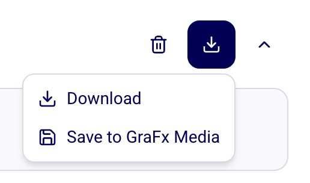

# GraFx Genie Product Image Creator

!!! example "Experimental feature"
      
    This capability is part of GraFx Labs and is experimental.  
    It can change or be removed at any time.  
    We look forward for your validation and feedback.

GraFx Genie Product Image Creator allows to generate and iterate product visuals using AI inside CHILI GraFx.

## What it does

- Generate new images using AI.
- Use prompts to describe the desired visual.
- Select an aspect ratio (for example 1:1 or 16:9).
- Upload a starting image from:
    - Your device
    - [GraFx Media](/GraFx-Media/)
- Iterate and refine results.

The tool supports both:

- Fully generated images.
- Augmented variations based on existing brand-approved assets.

## Creation flow

1. Select an **Aspect Ratio**.
2. Enter a descriptive prompt.
3. Optionally attach an image (upload or select from GraFx Media).
4. Click **Generate Image**.

### Add a brand-approved asset from GraFx Media

{.screenshot-full}

### Add prompt to augment the asset

{.screenshot-full}

## Result handling

After generation, you can:

- Edit the result.
- Upscale the image.

{.screenshot-full}

- Download locally.
- Save to GraFx Media.

{.screenshot-full}

This allows you to move from experimentation to reusable asset storage in GraFx Media.

## Billing

Generated images are charged as digital PNG renders.

## When to use it

Use this experiment when you want to:

- Rapidly explore visual directions.
- Generate campaign imagery without a full photoshoot.
- Augment existing on-brand assets.
- Validate AI image workflows before embedding them in Design Systems.

## Related concepts

- [GraFx Labs](/CHILI-GraFx/concepts/grafx-labs/)