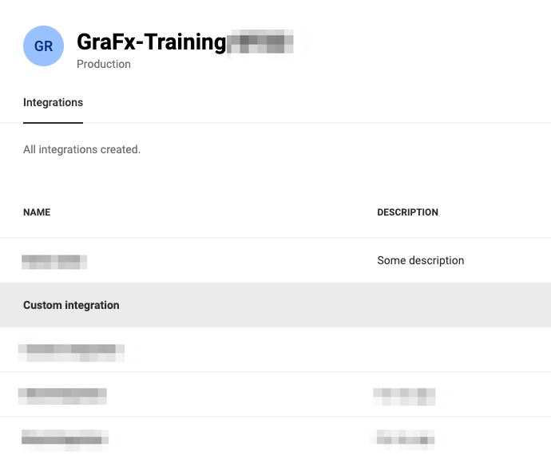

# CHILI GraFx Integration

Empower Your Custom Solutions

## Introduction

This guide will walk you through the process of defining an integration within the CHILI GraFx platform, obtaining the necessary credentials, and creating a token for seamless API communication. Integrating with CHILI GraFx enables you to leverage Smart Templates and customize the functionality of your applications. Let's get started!

## Step 1: Accessing the CHILI GraFx Platform

Log in to your [CHILI GraFx](https://chiligrafx.com/) platform account using your provided credentials.

## Step 2: Creating a New Integration

Navigate to [Environments](https://chiligrafx.com/environments) and click the pencil icon, right of the Environment.


### Add a new Integration


Click the "Create Integration" button.


Provide a meaningful name and description for your integration to easily identify it later.

Click "Create Integration" to finish.

### Edit an existing Integration

Click an existing integration to edit its details.



### Step 3: Obtaining Integration Credentials

After saving the integration configuration, click on the integration name, to see the details panel.

When looking at the details for your integration, you will notice that there are two tabs.

##### The General Tab
The `General` tab contains the information about your integration and the authentication credentials.

The CHILI GraFx platform will generate a set of credentials specifically for this integration.

These credentials include a `Client ID` and `Client Secret`. Make sure to securely store these credentials, as they we will use this information to generate our "access token" which we will then use to authorize our API requests.


##### Your Environment Swagger
At the bottom of the `General` tab you will notice that there are links to the Environment API and Platform API Swagger pages for your environment that you can interactively test endpoints with **after** [generating an access token](#step-4-generating-an-access-token)

##### The Permissions tab
The `Permissions` tab is where you can control the level of access your integration has to your environment.
Permissions are presented as API scopes, and will determine the access your integration has on the environment.


### Step 4: Generating an Access Token

Now we can request an access token using our `Client ID` and `Client Secret`. This token will serve as your application's authorization for subsequent API calls.


To get an access token we simply make a POST request to our auth server located at `https://integration-login.chiligrafx.com/oauth/token` and provide a couple fields. If all goes as intended, you will receive an access_token in your response.

Here are some examples for making this request

=== "cURL"
    ``` SH
    curl --location \
    --request POST 'https://integration-login.chiligrafx.com/oauth/token' \
    --header 'content-type: application/x-www-form-urlencoded' \
    --data-urlencode 'audience=https://chiligrafx.com' \
    --data-urlencode 'grant_type=client_credentials' \
    --data-urlencode 'client_id=<CLIENT_ID>' \
    --data-urlencode 'client_secret=<CLIENT_SECRET>'
    ```
=== "Python"
    ```python
    import requests

    endpoint = 'https://integration-login.chiligrafx.com/oauth/token'
    client_id = '<YOUR CLIENT ID>'
    client_secret = '<YOUR CLIENT SECRET>'

    resp = requests.post(
        url=endpoint,
        headers={
            "content-type": "application/json"
        },
        json={
            "grant_type": "client_credentials",
            "audience": "https://chiligrafx.com",
            "client_id": client_id,
            "client_secret": client_secret,
        }
    )

    if resp.status_code == 200:
        print(resp.json()["access_token"])
    else:
        raise Exception(f"{resp.text}")
    ```
=== "Node v18+"
    ```javascript
    const client_id = '<YOUR CLIENT ID>'
    const client_secret = '<YOUR CLIENT SECRET>'

    fetch('https://integration-login.chiligrafx.com/oauth/token', {
    method: "POST",
    headers: {
        'Content-Type': 'application/json'
    },
    body: JSON.stringify({
        'grant_type': 'client_credentials',
        'audience': 'https://chiligrafx.com',
        'client_id': client_id,
        'client_secret': client_id
    })
    })
    .then(response => response.json()
    .then(data => console.log(data)))
    ```
=== "Go"
    ```go
    package main

    import (
        "bytes"
        "encoding/json"
        "fmt"
        "net/http"
    )

    type AuthResponse struct {
        Token		string  `json:"access_token"`
        Expiration	int 	`json:"expires_in"`
        Type	    string  `json:"token_type"`
        Scope		string  `json:"scope"`
    }

    func main() {
        posturl := "https://integration-login.chiligrafx.com/oauth/token"

        body := []byte(`{
            "grant_type": "client_credentials",
            "audience": "https://chiligrafx.com",
            "client_id": "<YOUR CLIENT ID>",
            "client_secret": "<YOUR CLIENT SECRET>"
        }`)

        r, err := http.NewRequest("POST", posturl, bytes.NewBuffer(body))
        if err != nil {
            panic(err)
        }

        r.Header.Add("Content-Type", "application/json")

        client := &http.Client{}
        res, err := client.Do(r)
        if err != nil {
            panic(err)
        }

        defer res.Body.Close()

        response := &AuthResponse{}
        derr := json.NewDecoder(res.Body).Decode(response)
        if derr != nil {
            panic(derr)
        }

        if res.StatusCode != 200 {
            panic(res.Status)
        }

        fmt.Println("Token:", response.Token)
    }
    ```
=== "Java"
    ```Java
    // This expects a ResponseType class to be defined with the response JSON properties
    // `access_token`, `expires_in`, `scope`, and `token_type`
    Map<String, Object> body = new HashMap<>();
    body.put("grant_type", "client_credentials");
    body.put("audience", "https://chiligrafx.com");
    body.put("client_id", client_id);
    body.put("client_secret", client_id);

    BodyBuilder requestBuilder;

    try {
      requestBuilder = RequestEntity.method(HttpMethod.POST, new URI("https://integration-login.chiligrafx.com/oauth/token"));
    } catch (URISyntaxException e) {
      log.error("Invalid URI: {}", url);
      log.error(e);
      throw new InvalidRequestException("Invalid URL");
    }

    requestBuilder.contentType(MediaType.APPLICATION_JSON);
    RequestEntity<Object> requestEntity = requestBuilder.body(body);

    ResponseEntity<ResponseType> responseEntity = restTemplate.exchange(
      requestEntity,
      new ParameterizedTypeReference<ResponseType>() {}
    );
    if (!responseEntity.getStatusCode().is2xxSuccessful()) {
      // The error handler built into the RestTemplate should handle 400 and 500 series errors.
      throw new RestClientException(
        "API returned " + responseEntity.getStatusCode()
      );
    }

    log.info("Got response: {}", responseEntity.getBody());
    ```


This call is best done **server-side** to not expose the **client_id** and certainly not the **client_secret** in the browser. You can pass the resulting access token to your front-end

Extract the access token from the authentication response and securely store it within your application.

The access token is issued with an expiration offset. You can find this in the `expires_in` JSON property of the response. Ensure your application refreshes it's token when necessary. You simply repeat the process generate a new token.

### Step 6: Making API Calls

With the access token in hand, you can now include it in the headers of your API requests to the CHILI GraFx platform.
`Authorization: Bearer <YOUR ACCESS TOKEN>`

Refer to the [Developer](/GraFx-Developers/) documentation to explore the available endpoints, request parameters, and response formats.

Leverage the API calls to interact with the CHILI GraFx platform, perform operations such as creating, updating, or retrieving resources, and integrate its capabilities seamlessly into your custom solution.

You can use you access token to authorize and test calls in [your swagger](#your-environment-swagger)