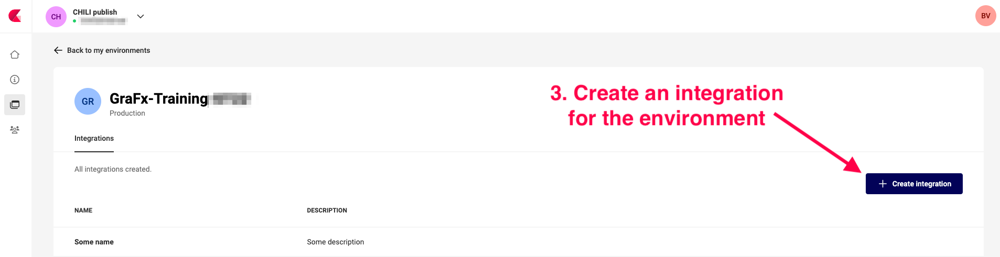
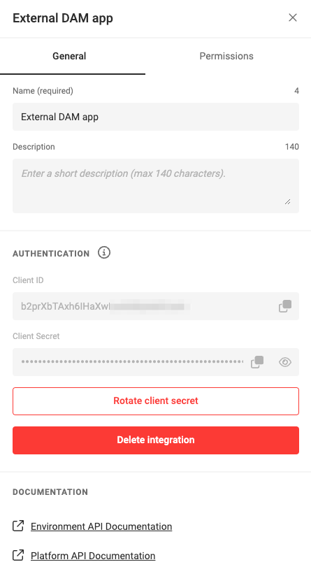
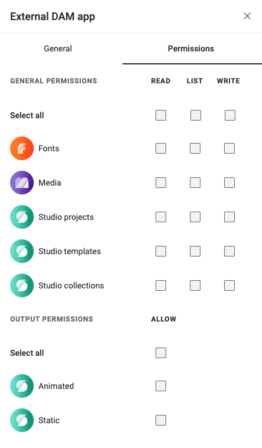

# CHILI GraFx Integration: Empower Your Custom Solutions

## Introduction

This guide will walk you through the process of defining an integration within the CHILI GraFx platform, obtaining the necessary credentials, and creating a token for seamless API communication. Integrating with CHILI GraFx enables you to leverage Smart Templates and enhance the functionality of your applications. Let's get started!

## Step 1: Accessing the CHILI GraFx Platform

Log in to your CHILI GraFx platform account using your provided credentials.

## Step 2: Creating a New Integration

Navigate to Environments and click the pencil icon, right of the Environment.


### Add a new Integration



Click the "Create Integration" button.


Provide a meaningful name and description for your integration to easily identify it later.

Click "Create Integration" to finish.

### Edit an existing Integration

Click an existing integration to edit its details.


### Step 3: Obtaining Integration Credentials

After saving the integration configuration, the CHILI GraFx platform will generate a set of credentials specifically for this integration.

These credentials include an integration ID, a client ID, and a client secret. Make sure to securely store these credentials, as they are essential for subsequent steps.

Click on the Integration name, to see the details

2 tabs: General details and Permissions





### Step 4: Generating an Access Token

The CHILI GraFx platform is now ready to provide an  access token. This token serves as your application's authorization for subsequent API calls.

How to get an access token?

``` JSON
"request": {
                "method": "POST",
                "header": [
                    {
                        "key": "content-type",
                        "value": "application/x-www-form-urlencoded"
                    }
                ],
                "body": {
                    "mode": "urlencoded",
                    "urlencoded": [
                        {
                            "key": "audience",
                            "value": "https://chiligrafx.com",
                            "type": "text"
                        },
                        {
                            "key": "grant_type",
                            "value": "client_credentials",
                            "type": "text"
                        },
                        {
                            "key": "client_id",
                            "value": "<CLIENT_ID FROM GRAFX INTEGRATION>",
                            "type": "text"
                        },
                        {
                            "key": "client_secret",
                            "value": "<CLIENT_SECRET FROM GRAFX INTEGRATION>",
                            "type": "text"
                        }
                    ]
                },
                "url": {
                    "raw": "https://integration-login.chiligrafx.com/oauth/token",                  
                }
            },
```

This call is best done server-side, to not expose the client_id and certainly not the client_secret in the browser._

Extract the access token from the authentication response and securely store it within your application.

The access token is issued with an expiration time set to 10 hours. Ensure your application is capable of refreshing the token when necessary.

### Step 6: Making API Calls

With the access token in hand, you can now include it in the headers or parameters of your API requests to the CHILI GraFx platform.

Refer to the [platform API](/GraFx-Developers/) documentation to explore the available endpoints, request parameters, and response formats.

Leverage the API calls to interact with the CHILI GraFx platform, perform operations such as creating, updating, or retrieving resources, and integrate its capabilities seamlessly into your custom solution.