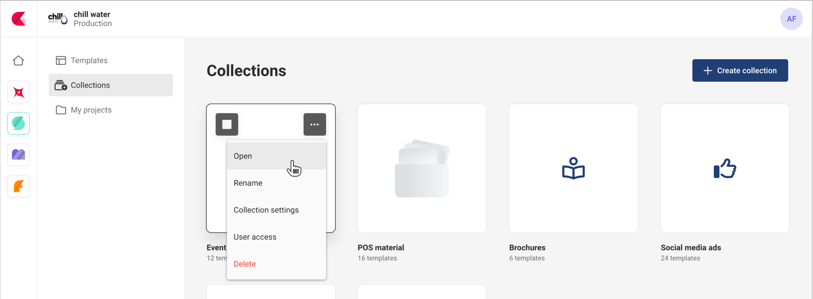
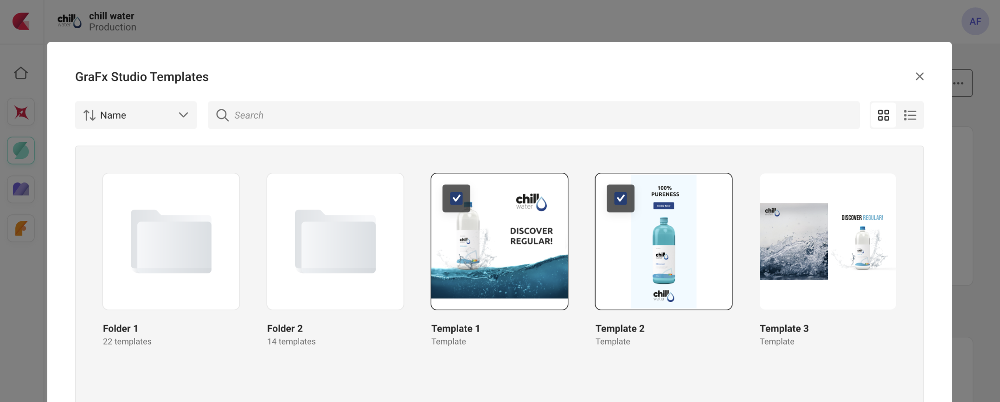

# Collections

See also: [Template workflow](/CHILI-GraFx/concepts/template-management/#template-collection) for the full story.

## Create a collection

To create your first collection, click the "Create collection" button, and name the collection.

A collection will appear in the list of collections.

## Add templates

Open the collection, to add templates to the collection.

A template browser is presented. You can select 1 or more templates, to be added to this collection.

## Reference

A reference to the template is stored.

When you delete a reference, the original template is not touched. You can remove individual references or complete collections, without affecting the original templates.

These GraFx Templates are stored in ... "Templates".

