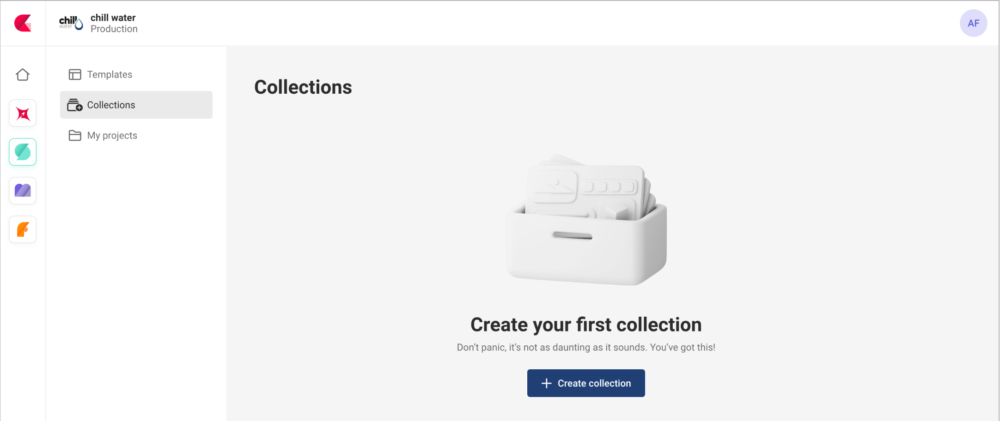
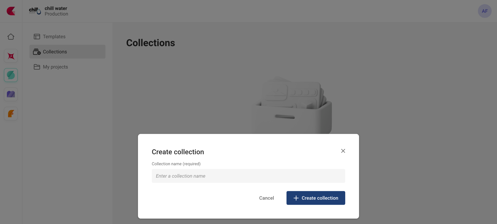
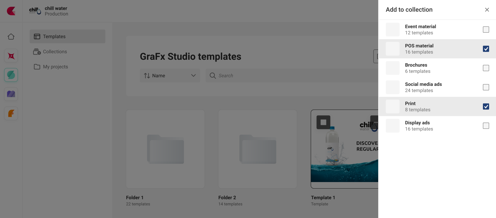

# Collections

See also: [Template process](/CHILI-GraFx/concepts/template-management/#template-collection) for the full story.

## Create a collection

To create your first collection, click the "Create collection" button, and name the collection.

A collection will appear in the list of collections.

## Add templates

Start at the templates, and choose to add to the collection from the contextual menu.

A list of collections is presented. You can select 1 or more collections, where the templates will be added.

### References vs actual templates

In the context of managing templates in a collection, it's important to understand the distinction between actual templates and the reference to that template.

When you add a template to a collection, you are simply creating a list that keeps track of the available templates in that collection. The actual template files themselves are not physically moved or altered in any way. The collection serves as a convenient catalog of templates.

Similarly, when you delete a template from a collection, it does not affect the original template. The deletion only removes the reference to that template from the collection, but the original template remains untouched.

In short: adding templates to a collection, deleting them from a collection, or removing collections altogether are administrative actions that manage the organization and accessibility of templates without making any changes to the actual template files.