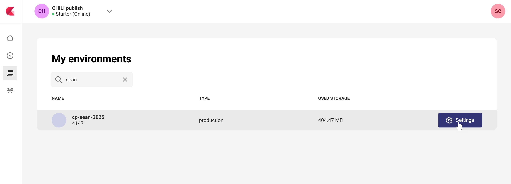
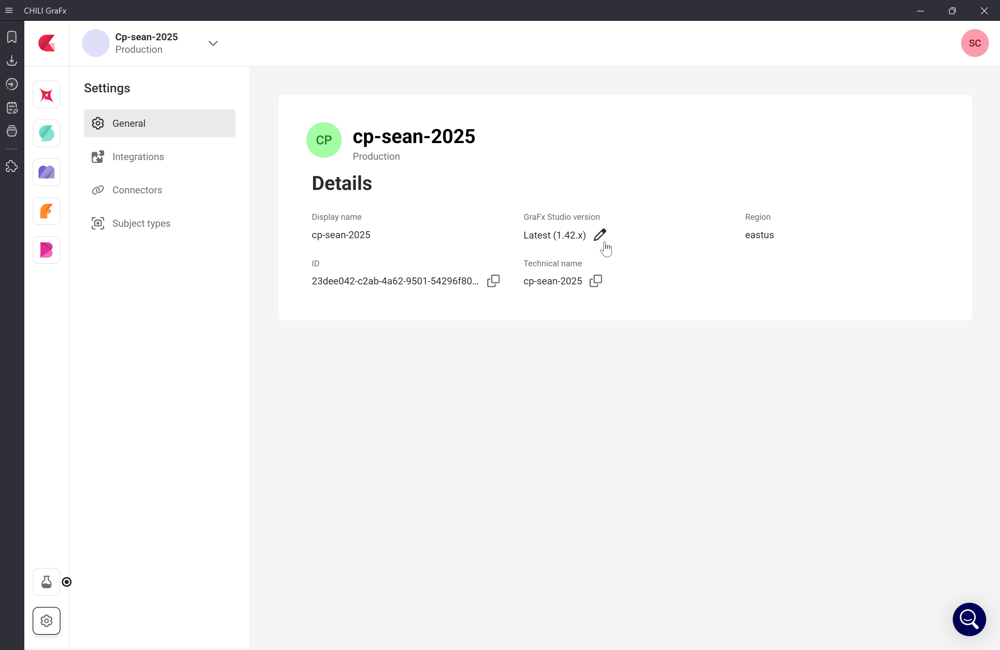
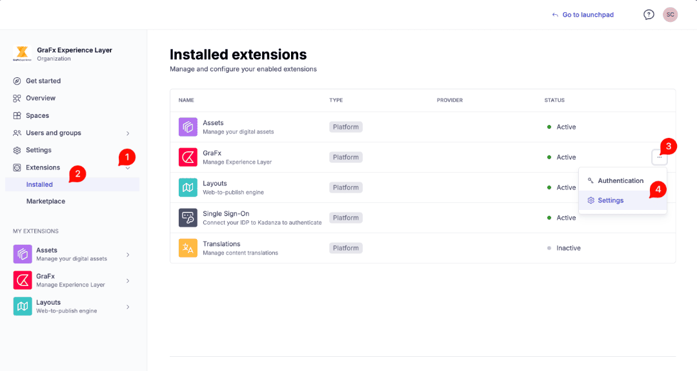
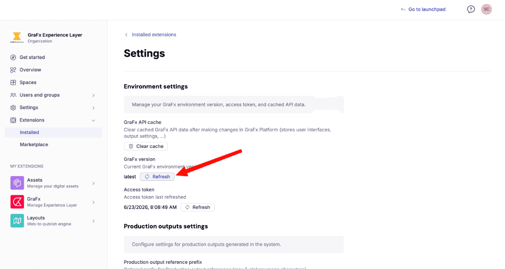

# Manage Environment Version

Every GraFx Studio environment has a **GraFx Studio version** setting. It controls which version of Studio is used by the templates and projects in that environment when they open and save. Pin to a specific version for stability, or set it to **Latest** to auto-update with each new release.

!!! warning "Admin access required"
    Only environment admins can change the version. If you don't see the settings described below, you don't have admin access on this environment.

## Set the GraFx Studio version

To set or change the GraFx Studio version of an environment:

1. Open the environment settings. You can do this two ways:

    **From inside an environment:** click the settings icon.

    {.screenshot-full}

    **From the environments overview** at [https://chiligrafx.com/environments](https://chiligrafx.com/environments): hover over an environment and click the settings button.

    {.screenshot-full}

2. In environment settings, find the **GraFx Studio version** field. By default this is **Latest** — meaning the environment auto-updates to the newest Studio release as soon as it ships. When set to Latest, the resolved version is shown in parentheses, e.g. `Latest (1.42.x)`.

    {.screenshot-full}

3. Click the **pencil icon** next to the version.

4. In the **GraFx Studio version** dialog, choose a specific version to pin to, or select **Latest** to switch back to automatic updates. Click **Update** to confirm.

    {.screenshot-full}

After you change the version, the environment settings reflect your choice.

!!! note "Existing templates and projects don't auto-upgrade"
    Changing the environment version doesn't migrate existing content. Templates and projects keep their current saved version until someone opens and saves them — at which point they're saved in the new version.

## Refresh GraFx Experience

If this environment is linked to GraFx Experience, you also need to refresh the GraFx version there after changing it. Otherwise there's a mismatch between the version running in the browser and the version running on the server, which causes output failures.

To refresh GraFx Experience:

1. Open your GraFx Experience admin settings.

2. Find the GraFx extension: click **Extensions** (1), click **Installed** (2), locate **GraFx** in the list and click the three dots **...** (3), then click **Settings** (4).

    {.screenshot-full}

3. On the settings page, find the **Refresh** button under **GraFx version** and click it. This syncs the two environments so they run the same version.

    {.screenshot-full}

## When to pin vs. stay on Latest

Pinning a version gives you control over when new Studio releases reach your environment. A deliberate versioning strategy helps you adopt new features and prepare for potential behavior changes at your own pace, so updates don't catch existing templates or production workflows off guard.

Common patterns:

- **Production environments:** pin to a specific version. Test new releases in a separate environment first, then update production once you're confident.
- **Test or staging environments:** stay on Latest to catch issues with new releases before they affect production.
- **Single-environment setups:** pin to a specific version and update on a schedule you control.

!!! info "Staying ahead of changes"
    We communicate changes in release notes, and in cases of potential breaking changes we will communicate via email ahead of time so you can prepare. In rare cases, an urgent fix — such as a security or SLA-related update — may ship with behavior changes on a shorter notice cycle. Pinning your production environment gives you full control over when those changes take effect.

## Compatibility rules

Before changing the version, know the basic rule: templates and projects saved in a newer version cannot be opened in an older version. This makes downgrades a one-way risk — once content has been saved in a newer version, re-pinning the environment to an older version leaves that content inaccessible until you re-pin upward.

For the full compatibility model — including backwards compatibility, SDK compatibility, and worked examples — see [Compatibility Rules](/GraFx-Developers/grafx-studio/integration-overview/05-versioning/#compatibility-rules) in the developer documentation.

## Related

### For designers

If you design templates, the version your environment runs on directly affects which environments can later open the templates you save. See [Guidance for Designers](/GraFx-Developers/grafx-studio/integration-overview/05-versioning/#guidance-for-designers) for the rollback problem and best practices.

### For integrators

If you build the application that loads Studio UI or the Studio SDK, your integration code must stay in sync with the environment's configured version. See [Guidance for Integrators](/GraFx-Developers/grafx-studio/integration-overview/05-versioning/#guidance-for-integrators) for CDN URL structure, SDK pinning with `~` vs `^`, and how to read the environment's current version via the API.

### Full picture

For the full picture of how versioning works — including compatibility rules, the patch update policy, the one-year grace period, the API for reading and changing the environment version, and a recommended update workflow — see [Versioning Your Integration](/GraFx-Developers/grafx-studio/integration-overview/05-versioning/) in the developer documentation.

