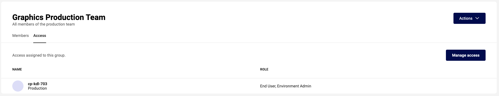
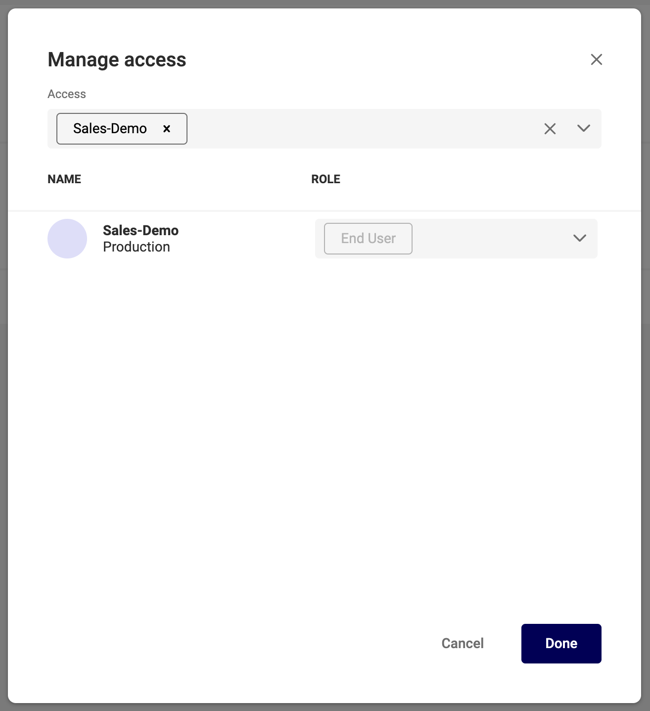

# User Group Access

!!! Info "Access"
	Access is the set of rules that defines the role a user get to a certain environment.

## Manage Access

Click the "Access" tab, in the group page.

Click "Manage Access" to add or revoke access to that group.

Under Access, add or remove the Environments.

Below, with each environment, add the role the group members will receive for that environment.