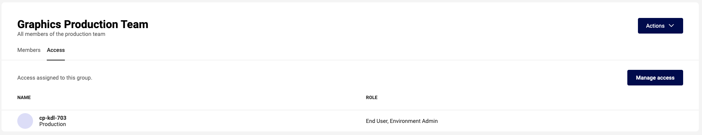
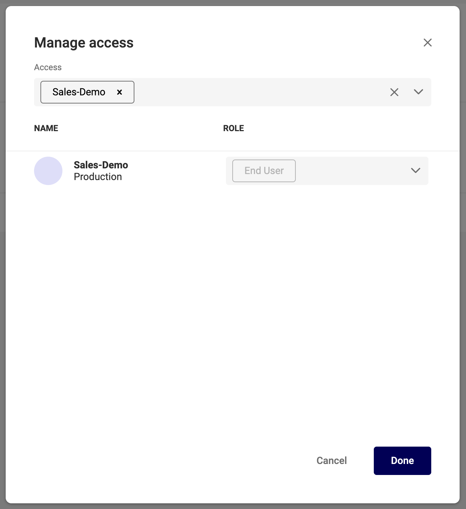

# User Group Access

!!! Info "Access"
	Access is the set of rules that defines the role a user gets in a certain environment.

## Manage Access

Click the "Access" tab, on the group page.

{.screenshot-full}

Click "Manage Access" to add or revoke access to that group.

{.screenshot}

Under Access, add or remove the Environments.

At the bottom part, you'll see each environment listed in the access field. Add the role the group members will receive in that environment. By default, the "End User" role is assigned, and you can add additional roles if wanted, for each Environment.

## Template Designer Seats

You won't be able to give Template Designer Seat through a group assignment. You'll have to [assign the Seat](/CHILI-GraFx/users/template-designer/) to each individual user.