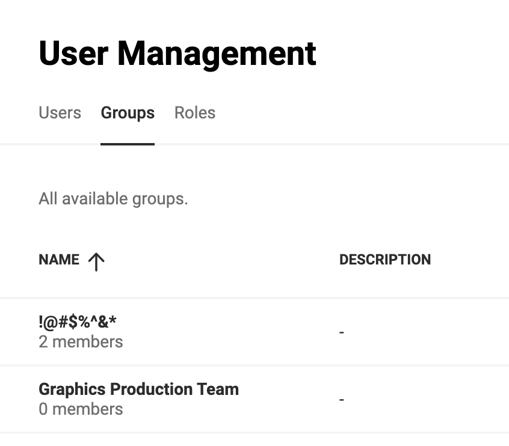
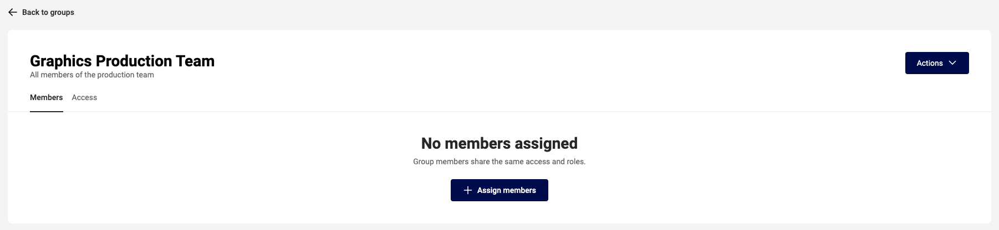
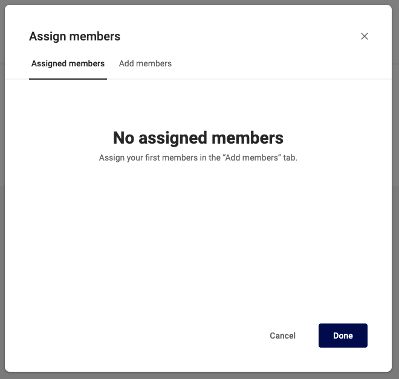
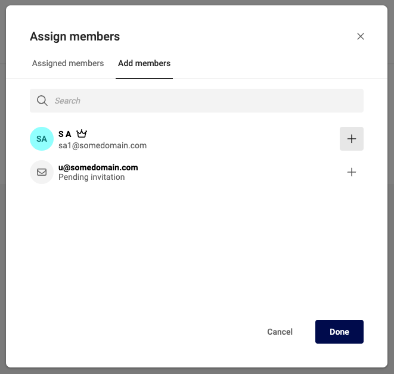
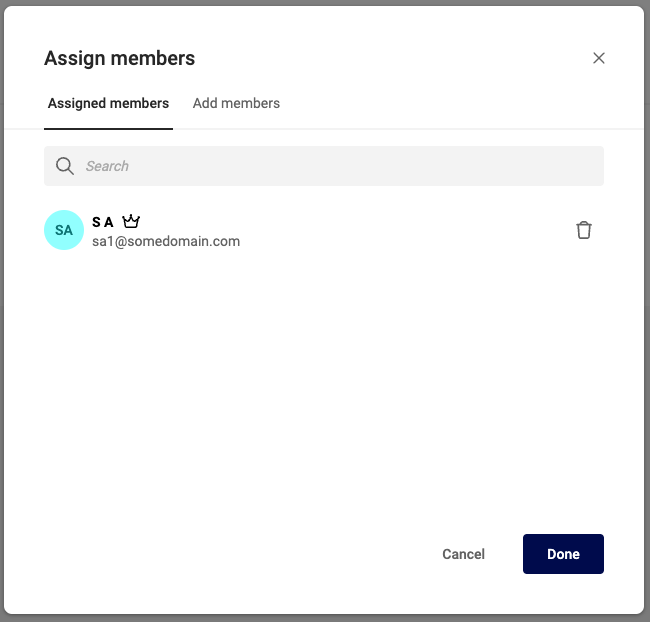
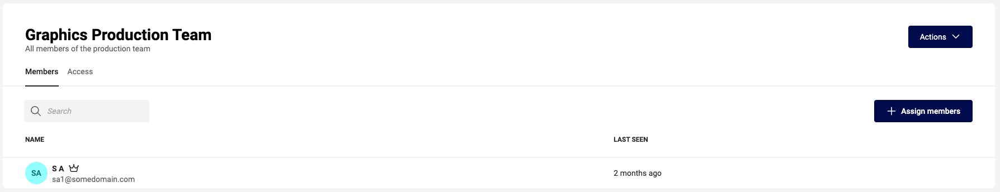
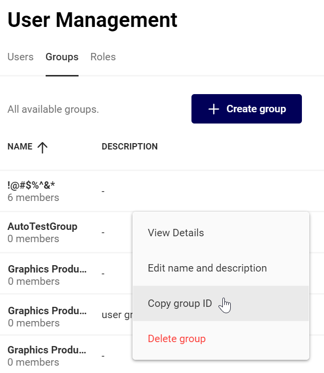

# User Group Membership

## Manage membership of non-federated users

Go to User Management, click "Groups", click on the group you want to manage. "Graphics Production Team"

{.screenshot}

The members will be listed, if no members are present, click "+ Assign members"

{.screenshot-full}

To add members, click on the second tab "Add members". You'll see a list of users, that have not been assigned as a member.

If you don't see the user you want to add:

- They are already a member
- They don't exist as a user in the Subscription

{.screenshot}

Click on the "+" (plus) sign to add the user to the current group.

They disappear from the list, and will be under the "Assigned members" tab.

{.screenshot}

Under "Assigned members" you can "delete" a member. This will revoke group membership, but will nog remove the user from the Subscription.

{.screenshot}

When done, you'll see the members under the "Members" tab.

{.screenshot-full}

## Manage membership of Federated users

Group membership of federated users are managed in the third-party identity provider (IDP).

All group membership operations are disabled for federated users because group membership information from the third-party IDP overrides the information in CGX.

When a user authenticates in a third-party IDP, the authentication must include the identifiers of the groups the user belongs to.

To get the identifier from a group, click on "Copy group ID" in the group drop-down.

{.screenshot-full}

For additional information on the claims used, check the related security protocol guides: [SAML](/CHILI-GraFx/guides/setup-fsso/saml/) and [OpenID Connect](/CHILI-GraFx/guides/setup-fsso/oidc/).

The details on managing the group membership in the third-party IDP varies from vendor to vendor. Please contact your IT support team for further details.