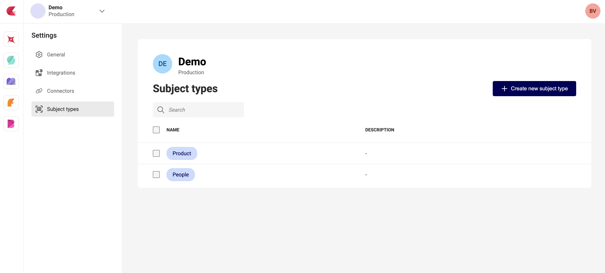

# Manage Subject Types

A **subject type** is a category — such as *person*, *product*, or *logo* — that tells [GraFx Genie Smart Crop](/GraFx-Studio/concepts/genie-smart-crop/) what kind of subject an image contains. Each subject type can store its own Subject Area and Point of Interest on an asset, so the same image can be cropped differently depending on the intent.

Subject types are managed **per environment** by an environment admin. Template designers and end users pick from the list defined here.

## Open the Subject types page

In the CHILI GraFx platform, make sure the correct environment is selected, then open **Settings**. In the Settings sidebar, select **Subject types** (shown beneath General, Integrations, and Connectors).

{.screenshot-full}

The page shows a search field and the list of subject types currently defined for the environment, with a **Name** and **Description** column.

## Create a subject type

1. Click **+ Create new subject type**.
2. Enter a **Name** — this is the label shown in the **Subject type** dropdown in GraFx Studio and on the media detail view.
3. Optionally enter a **Description** for internal reference (not shown to end users).
4. Confirm to save.

The new subject type appears in the list and is immediately available across the environment.

!!! tip "Keep names simple and stable"
    Names are used as identifiers in asset metadata and in templates. Renaming a subject type later may cause frames that reference it to fall back to **Default** — choose clear, stable names from the start.

## Edit a subject type

Select a subject type from the list and update its name or description. Confirm the change to apply it across the environment.

## Delete a subject type

Select one or more subject types with the row checkboxes, or open the actions menu on a single row, then choose **Delete** and confirm.

When a subject type is deleted:

- Per-type Subject Areas and POIs stored on assets under that type are no longer referenced.
- Image frames that were set to the deleted subject type fall back to **Default**.
- The **Default** Subject Area and POI on assets are never affected by subject type changes.

## Find a subject type

Use the **Search** field above the list to filter by name. Useful in environments with a long list of types.

## The Default subject type

Every asset has a built-in **Default** Subject Area and Point of Interest, detected automatically on upload in GraFx Media. **Default** is always available and cannot be removed — it is the fallback used whenever no subject type is selected on an image frame. It does not appear in the list on this page.

## Where subject types are used

- **GraFx Media / media connector overlay** — on the media detail view, a **Subject type** dropdown lets you set and view a separate Subject Area and POI per type. See [Set Subject Area for Smart Crop](/GraFx-Media/guides/smart-crop-subject-area/#subject-type).
- **GraFx Studio** — on an image frame with Smart Crop active, a **Subject type** dropdown selects which type drives the crop. See [Select a Subject type](/GraFx-Studio/guides/smart-crop/#select-a-subject-type).
