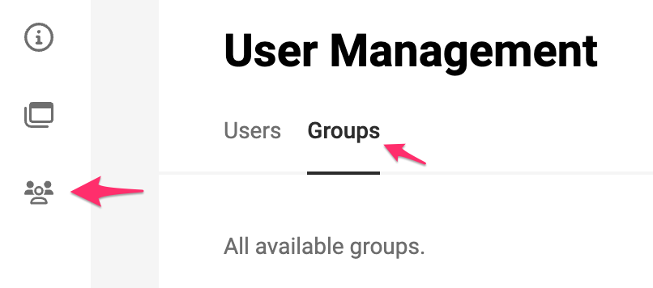
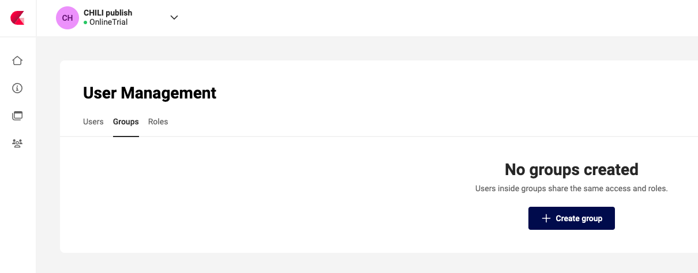
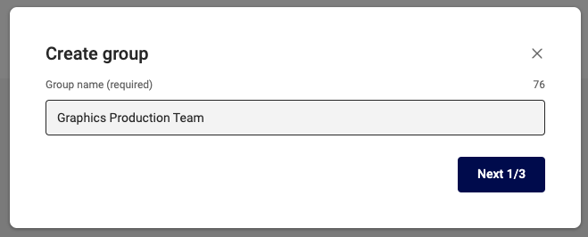
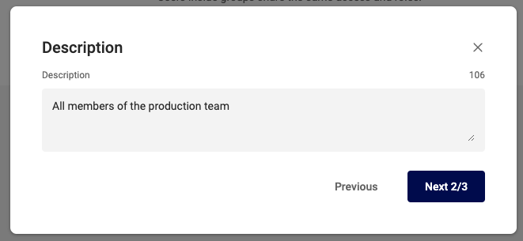
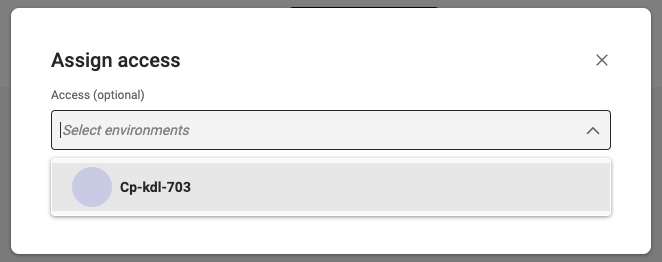
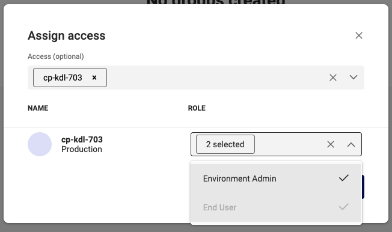
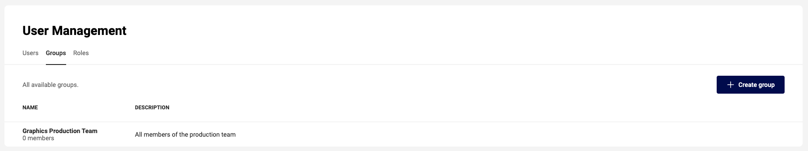
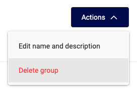
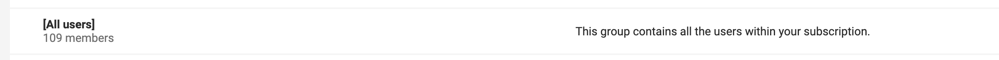

# User Group Management

## Create User Group

Go to User Management, and click "Groups"

{.screenshot}

Start with "+ Create group".

{.screenshot-full}

Give the user group a name. (Step 1/3)

{.screenshot}

Give an (optional) description (Step 2/3)

{.screenshot}

Assign Access, similar to [Individual Access assignment](/CHILI-GraFx/guides/manage-individual-access/).

- Select the Environments the group has access to
- Select the Role everybody in this group will have, for this Environment

{.screenshot}

{.screenshot}

The group will appear in the list, showing "0" members.

{.screenshot-full}

## Delete a User Group

To delete a group, select the group, en "Delete Group" under the Actions drop down menu

{.screenshot}

Upon deletion, all members are removed from the group, and the related access is revoked.

Unless if the person still has access through [Individual Access](/CHILI-GraFx/guides/manage-individual-access/), or through membership of another group.

## Manage User Group Membership

See [Manage Group Membership](/CHILI-GraFx/guides/manage-group-membership/)

## Special group: [All users]

This group is available by default, and cannot be renamed.

The group contains all users from the current subscription.

This group can be used, to provide specific access for all users (current and new).

{.screenshot-full}