# User Account Migration

## 1. Your setup is ready

You have received an email, notifying your account is setup.

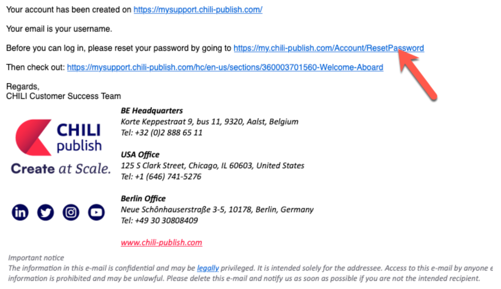{.steps}

## 2. Reset your password

### Start reset password

Before you start, reset your password. [here](https://my.chili-publish.com/Account/ResetPassword), using your email as your login.

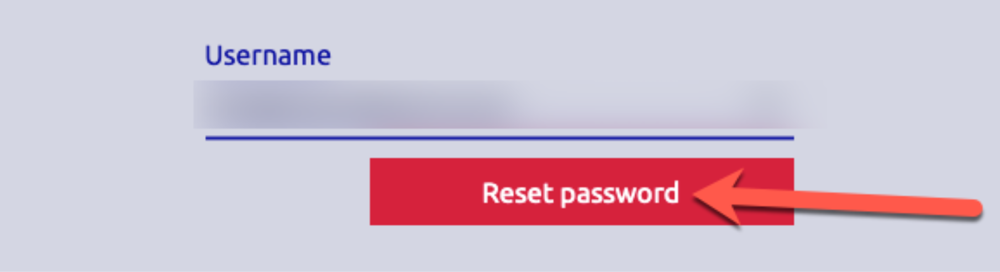{.steps}

### Confirm the email

You will receive an email, where you need to follow the link to confirm you initiated the password reset.

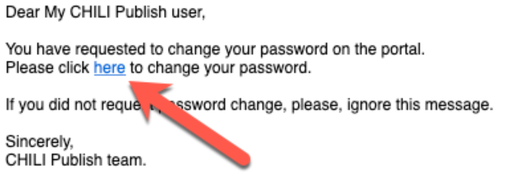{.steps}

### Enter new password

The link in the email will bring you to a page to enter your new password.

Your password should follow these guidelines:

- Contain at least 16 characters
- Cannot contain parts of your full name that exceed 2 consecutive characters
- Must contain characters from 3 of the following 4 categories
	- uppercase characters (A - Z)
	- lowercase characters (a - z)
	- base 10 digits (0 - 9)
	- non-alphabetic characters (eg, !, $, #, %)

Confirm "Change password"

{.steps}

## 3. Logging in

### You have not migrated yet

Go to [My CHILI publish](https://my.chili-publish.com) and log in.

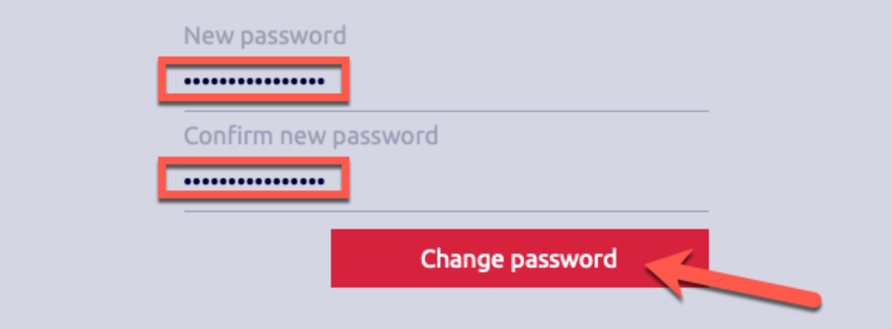{.steps}

!!! Warning
	You did migrate before?

	Go to [CHILI GraFx](https://chiligrafx.com/) to log in

## 4. Migration to CHILI GraFx

These steps are only necessary, if you did not migrate yet

### Migration prompt

The first time you arrive on CHILI GraFx, arriving from My CHILI publish, you'll be prompted to migrate.

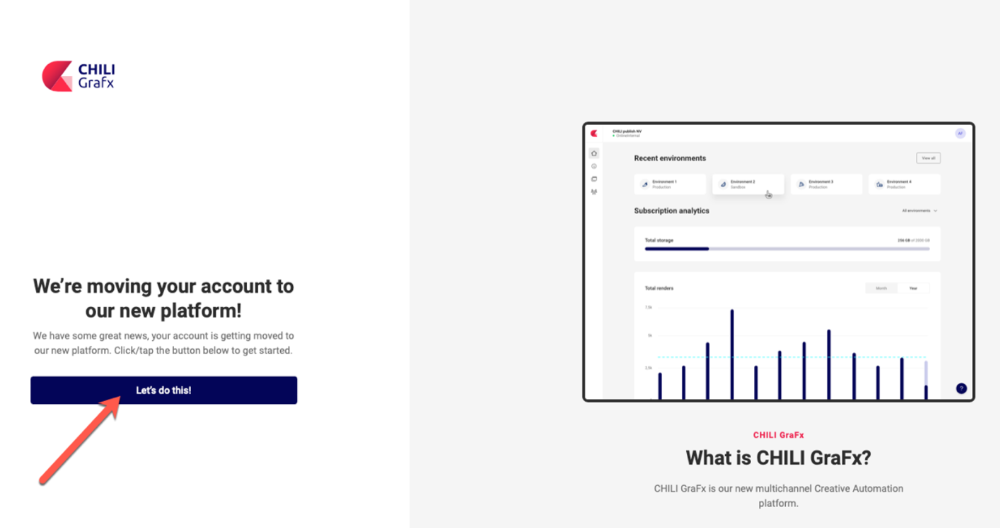{.steps}

### Confirm your email address

The Email field will be pre-populated with your login (email).
Confirm your email.

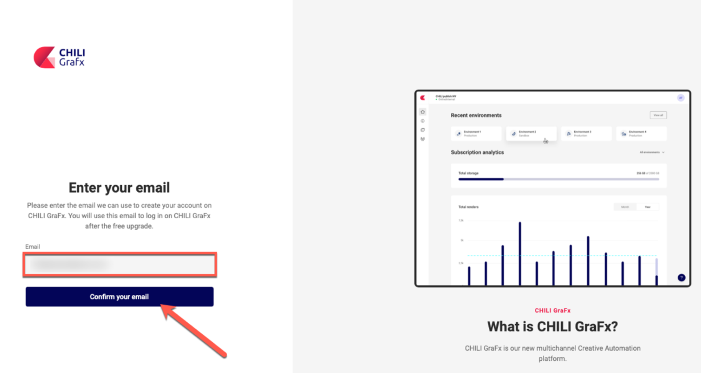{.steps}

### E-mail link

You'll receive an email, where you need to confirm the migration to CHILI GraFx.

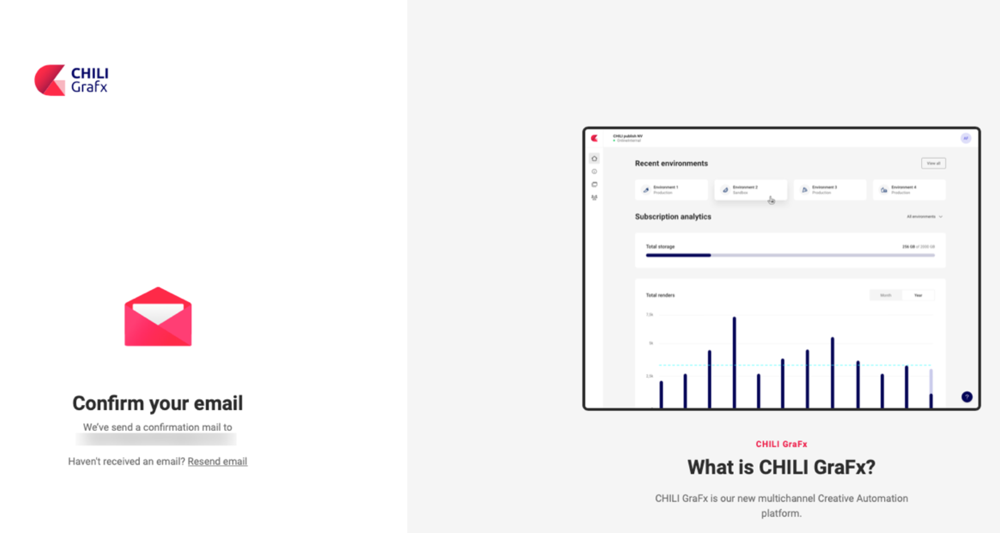{.steps}

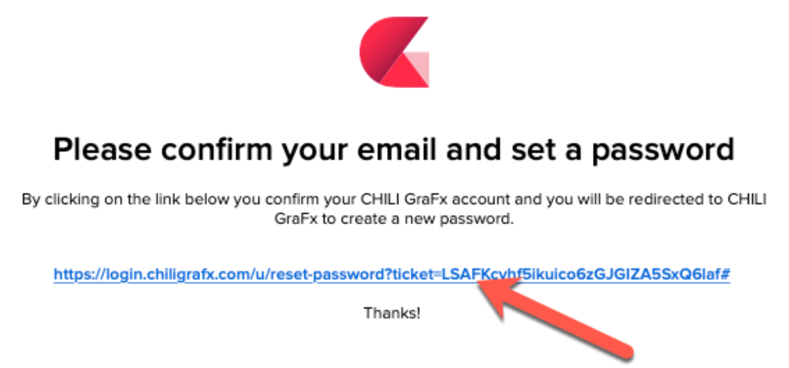{.steps}

### Confirm your new password

On the page in CHILI GraFx, confirm your new password.

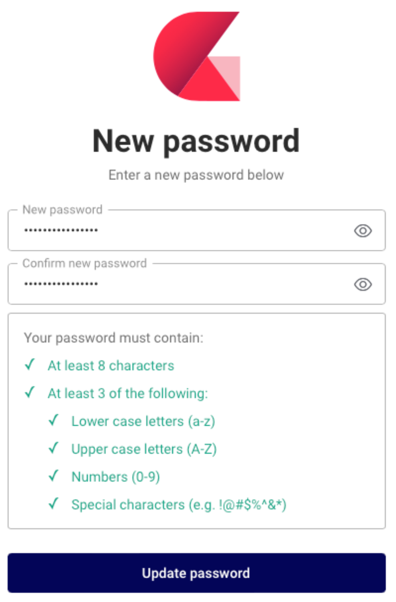{.steps}

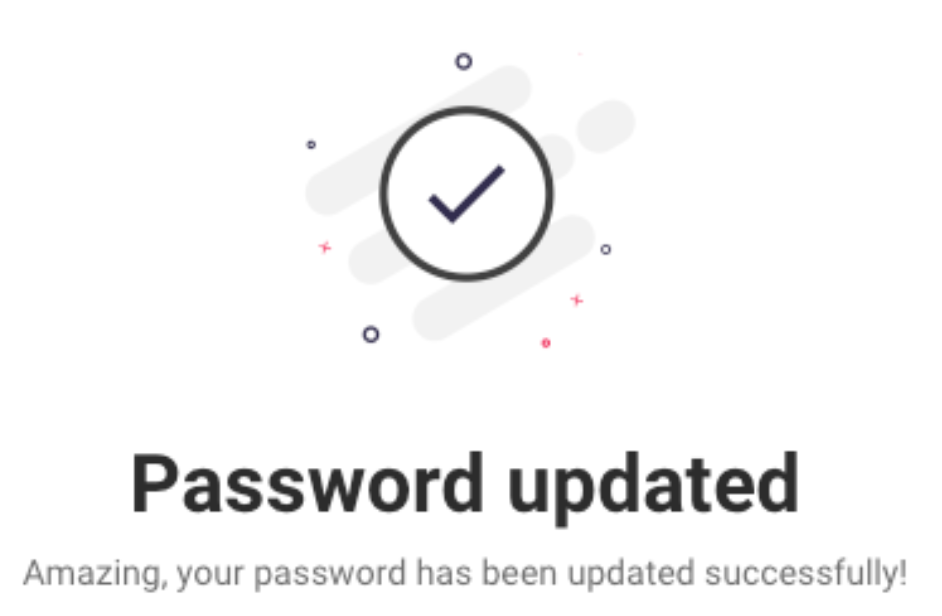{.steps}

## 5. Logging in to CHILI GraFx

Go to [CHILI GraFx](https://chiligrafx.com/) to login with your credentials

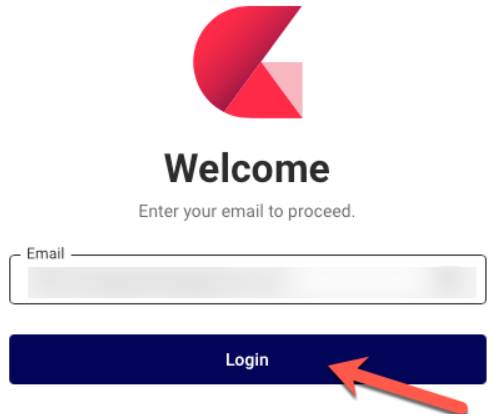{.steps}

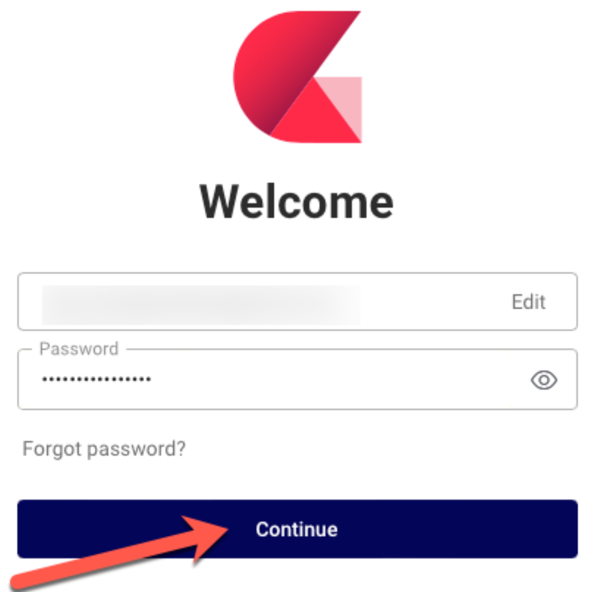{.steps}

Congratulations, you are now ready to start your **Creative Automation** journey!

## Where to go now?

### Support platform

In the platform, you can click the question mark, in the bottom-right corner.
Click "Support" to access the support platform. (use the same CHILI GraFx credentials to login).

{.steps}

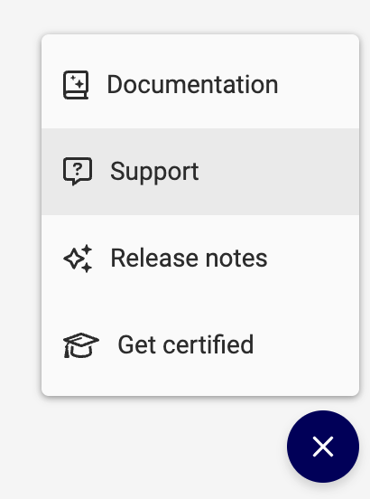{.steps}

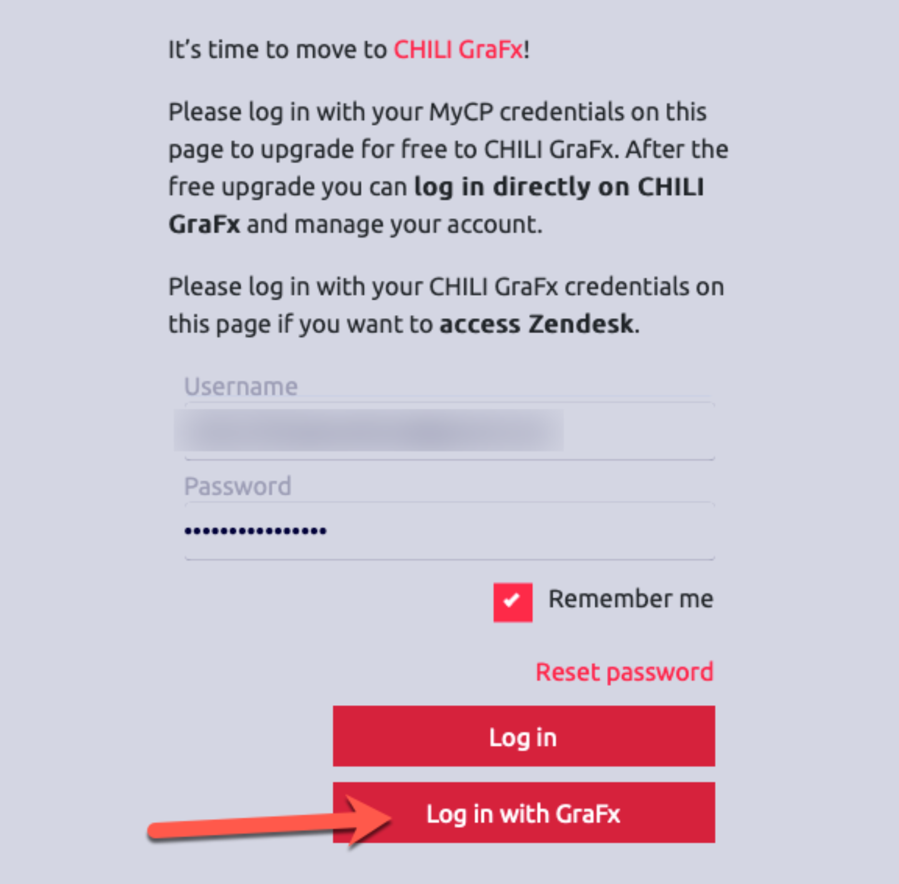{.steps}

Choose the "Log in with GraFx" button.

## Extra resources

Once logged in, [these (restricted) pages](https://mysupport.chili-publish.com/hc/en-us/sections/360003701560-Welcome-Aboard) handle some of the common questions.

- Creating Chili GraFx Users
- The SPICY road trip: Academy
- Best Practices to Submit a New Support Ticket
- Release Notes
- Getting to Know the CHILI BackOffice
- Using MySupport
- New Support Portal FAQ
- Making A Request Ticket
- Export Tickets From Old Platform
