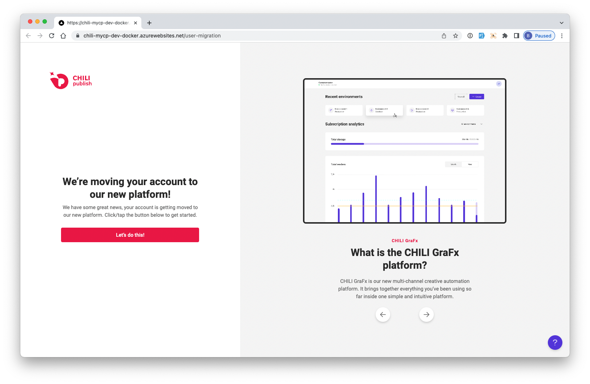
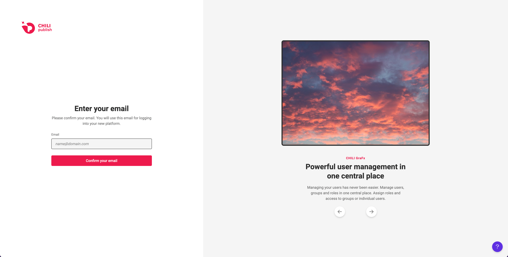
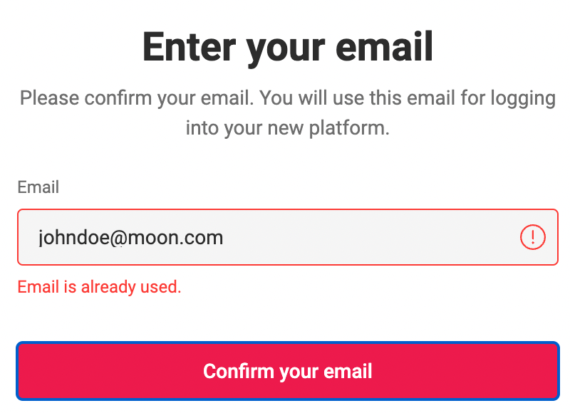
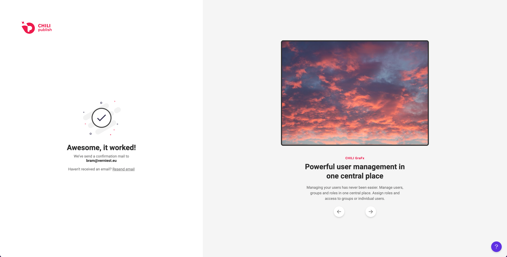

# Upgrade from My CHILI publish

## My CHILI publisher

My CHILI publisher (MyCP in short) has evolved into the CHILI GraFx. The platform hosting all applications to serve to Creative Automation tools.

Part of CHILI GraFx is the User management, Subscription management, etc. The functionality of MyCP moved on to CHILI GraFx.

If you haven't migrated yet, this is the right time!
[Migrate now](/CHILI-GraFx/guides/onboarding/migration/)

For the legacy MyCP documentation visit [MyCP Dodumentation](https://chilipublishdocs.atlassian.net/wiki/spaces/CPDOC/pages/1373405185/My+CHILI+publisher+a.k.a.+MyCP){target=_blank}.

## Why upgrade?

Your account was part of the My CHILI publish portal.

CHILI GraFx is a platform and hosts applications. Next to hosting applications, the platform also offers the opportunity to have resources shared amongst applications.

Therefore your account(s) need to upgrade from MyCP to CHILI GraFx.

### Phase 1

In the first phase, your MyCP account will be migrated

### Phase 2

When phase 2 goes live, your CHILI publisher (backoffice) accounts will also migrate to CHILI GraFX.
The roles and functionality will be respected and mapped to new CHILI GraFx users.

### Phase 3

You will be able to connect third party Identity Providers to CHILI GraFx

## How to upgrade?

### Step 1: Confirm you want to start the wizard

Logging on to [CHILI GraFx](https://chiligrafx.com){target="_blank"} will bring you to this screen

### Step 2: Provide your email

Provide your email, you used to login to My CHILI publish before.

If you use enter email that is in use, you will get notified.

If your email is known in the platform, CHILI GraFx will let you know.

### Step 2: Confirm your email

A confirmation email awaits you, and will bring you to the activated CHILI GraFx dashboard.