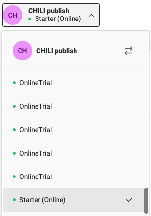
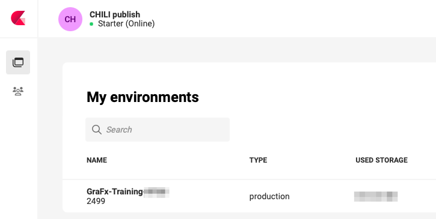
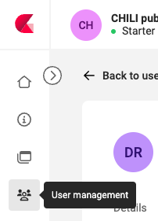

# User management

## Change role & access

### Subscription Admin

If you have access to multiple subscriptions, first select the subscription where you want to make changes.

If you have access to only 1 subscription, you will see your subscription only. (without dropdown icon)

### Environment Admin

As Environment admin the process is similar. But you won't need to choose a subscription. And you only see the subscriptions you have access to.

If you don't see an environment you should see, please contact your Subscription Admin, to provide you access to other environments.

### Changing access and role

Go to User Management

#### Set Individual Access

[Set individual access](../manage-individual-access/)

#### Access through a group

[Greate User Group](../manage-user-groups)

[Group Membership](../manage-group-membership)

[Group Access](../manage-group-access)
