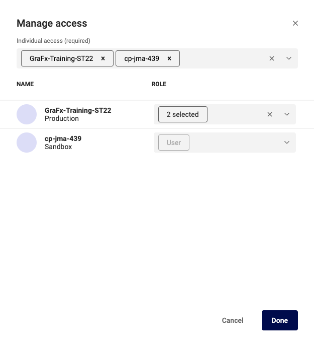

# User Management

## Set individual access

See here

Select the user you want to change, and select the tab "Individual access"

Click "Manage access"

In the "Individual access" field, add / remove Environments.
For each environment in the list, assign / remove roles in the list below.

Click the role dropdown, and assign or remove the role for that environment.

The "User" role is default, and cannot be removed.

