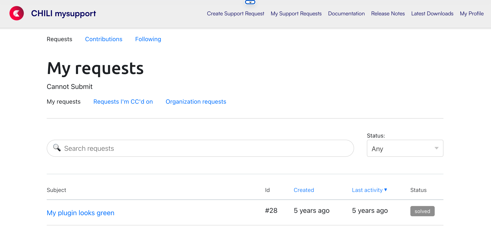

# CHILI GraFx support

The fastest way to contact the CHILI publish team for technical assistance is the Support Portal. You can access the [Support Portal](https://mysupport.chili-publish.com/) here. 

If your account was locked out, and you don't have access to the support portal, or you prefer to communicate by email, you can always send us an email.

In the CHILI GraFx platform, you can also access the link to support.

## Step by step

1. Log into your account at [CHILI GraFx](https://chiligrafx.com).  
If you do not have an account, skip to the section about contacting support via email. 
2. Use the icon to open the menu at the lower right corner of the page. 
3. Choose the Support link from the menu to launch CHILI’s Support Portal. 

More information about navigating the  CHILI GraFx Platform navigation can be found here: [GraFx Platform Navigation](/CHILI-GraFx/guides/onboarding/navigation/)

## MySupport
Using your GraFx account, you can access the support portal: [MySupport](https://mysupport.chili-publish.com). Not all GraFx accounts have support access, if you require an account to have support access please create a support ticket or contact your account manager.

Click the Support link to view existing support tickets or create a new one.

After creating a ticket, you will receive an email with a summary of the ticket. To update the ticket you may come back to [MySupport](https://mysupport.chili-publish.com) or reply to the summary email. When a Client Success Engineer or another team member replies to your ticket, you will receive an email notification.

## Email to create a ticket

**support at chili-publish.com**

You can also create tickets in this portal by sending an email.

You can add your colleagues to the ticket by including them on the CC line of the email. You can also keep your CSM or other 3rd parties in the loop by adding their email address to the CC of the email.

## Good to know

Once you logged in...

- [Best practices](https://mysupport.chili-publish.com/hc/en-us/articles/360019123140-Best-Practices-to-Submit-a-New-Support-Ticket)
- [How-to’s](https://mysupport.chili-publish.com/hc/en-us/articles/360012616660-Making-A-Request-Ticket)
- [FAQs](https://mysupport.chili-publish.com/hc/en-us/articles/360012877560-New-Support-Portal-FAQ)
- [Welcome Aboard](https://mysupport.chili-publish.com/hc/en-us/sections/360003701560-Welcome-Aboard )
