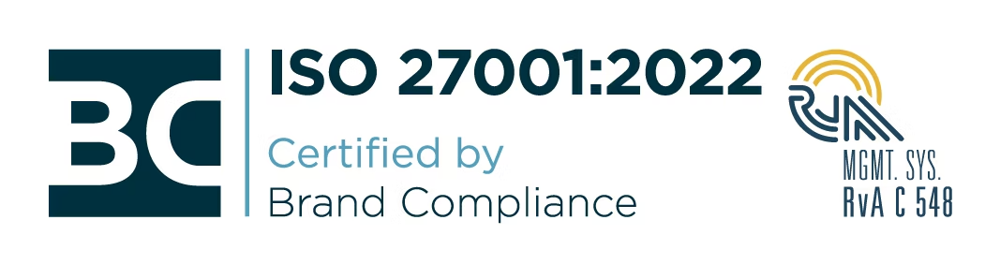

# Compliance

## Privacy

We are committed to protecting the privacy of your and your customers' data, and preventing it from unauthorized access with industry best-practices.

See [privacy statement](https://www.chili-publish.com/legal/)

## Security

All CHILI publish associates are formally trained on the proper use of four different information classification levels to make sure your data is handled safely.

These classifications are [listed on our website](https://www.chili-publish.com/security/).

## Compliance

Our compliance team works hard to meet your organization’s compliance needs. We are proud to announce we are ISO27001:2017 certified.

[Download statement of applicability](https://cdn6.chili-publish.com/hub/Legal/CHILI_publish_ISO27001_Statement_of_Applicability_v121_Jul17th_2024.pdf)

[ISO 27001:2017 Certificate](https://cdn6.chili-publish.com/hub/Legal/NL_1853.1.1_CHILI_publish_NV_ISO_27001.pdf)