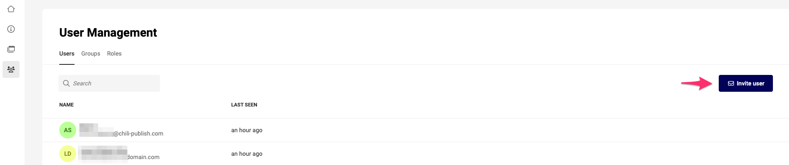
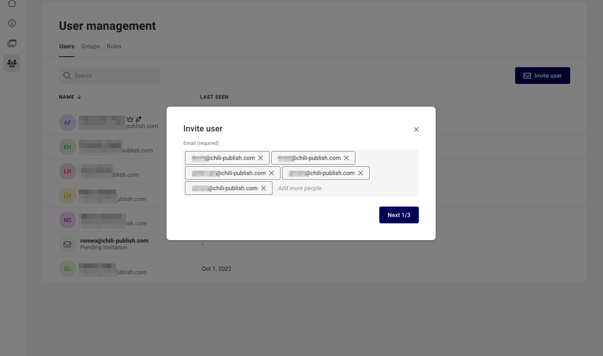
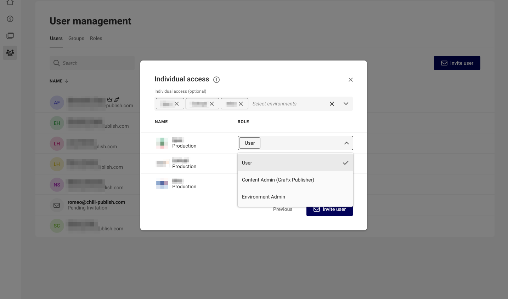

# User management

## User creation and invitation

The first user will be a Subscription Admin, and is created by CHILI GraFx, as a result of a signed contract.

The first user could also be created after a migration from MyCP. If you had a user in MyCP, and you followed the migration process, this user is now a CHILI GraFx user.

### Subsequent Users

### Invite users

With the [Subscription Admin](/CHILI-GraFx/users/roles/#subscription-admin) or [Environment Admin](/CHILI-GraFx/users/roles/#environment-admin) role, you can invite users.

Enter 1 or more email addresses of the people you want to invite.

Assigning the environment and role happens in the next step.

### Existing MyCP users

In case some of your users are using MyCP or Zendesk, they can migrate their users to CHILI GraFx by accessing https://my.chili-publish.com.

The system will suggest to start the migration process.