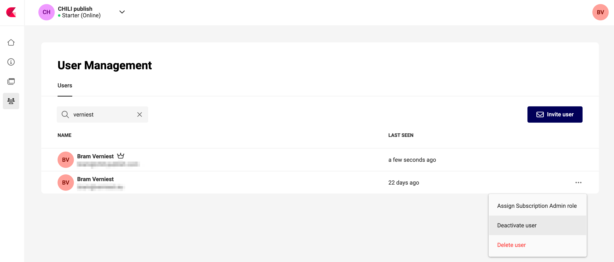
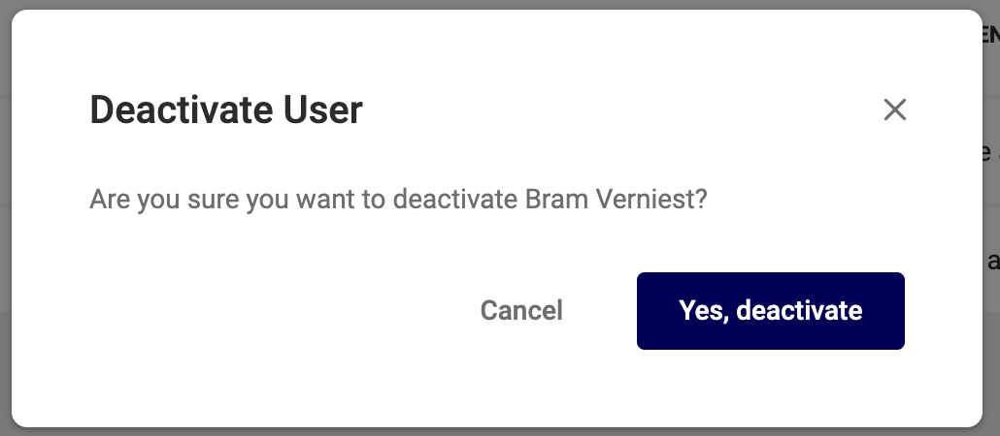
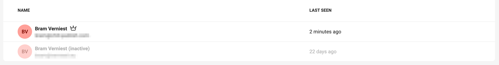
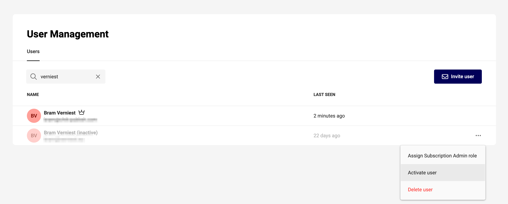
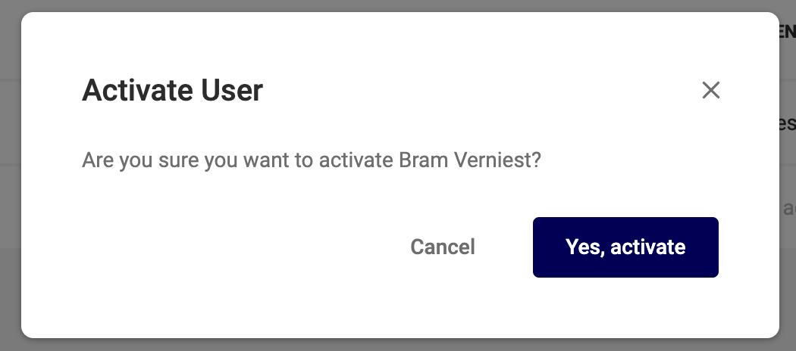

# User management

## Deactivate a user

In situations where a user's access to the platform needs to be temporarily suspended, you have the option to deactivate their account. 

During this deactivation period, the user will not have access to any platform resources. 

However, their access settings and group memberships are retained. This ensures that once the account is reactivated, the user can resume work seamlessly with their previous settings and group affiliations intact.

### Deactivate

In the user management, hover over the three dots on the right.

{.screenshot-full}

Confirm the deactivation

{.screenshot}

The user will appear gray.

{.screenshot-full}

### Activate

Click Activate under the same "..." menu to reactivate the user.

{.screenshot-full}

{.screenshot}