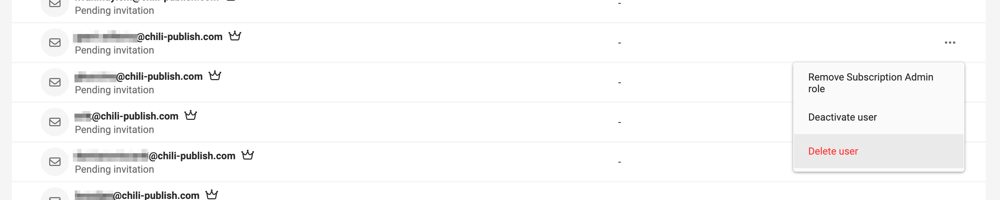
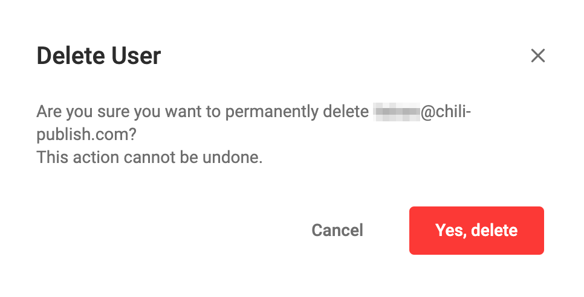

# User management

## Delete a user

In CHILI GraFx, deleting a user results in the permanent removal of their account. This action is irreversible. 

Once a user account is deleted, all associated access privileges are permanently eradicated. It's crucial to consider the implications of this action carefully, as it cannot be undone. 

This ensures complete removal of the user's access and data from the platform.

### Delete

In the user management, hover over the three dots on the right.

Confirm the action, if you are sure.

