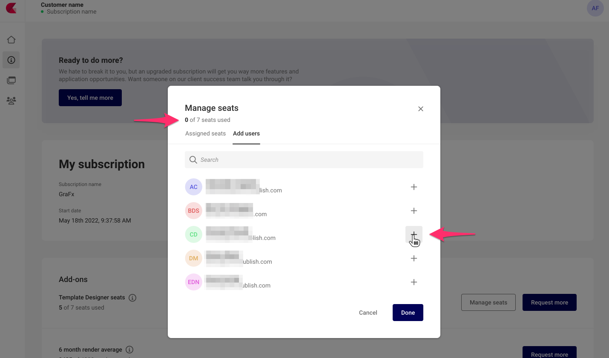
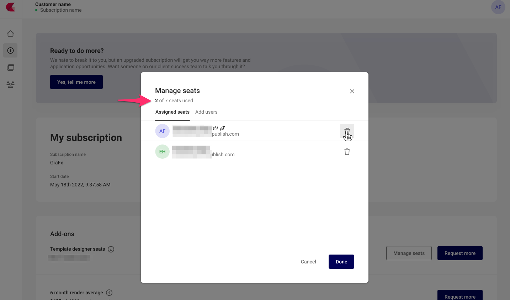

# Template Designer (seats)

The Template Designer role deserves its own page. This role differs from the others because the number of users that can be assigned this role is limited.

Your contract defines how many users can be assigned this role.

!!! Definition
	A Template Designer can create templates in the CHILI GraFx environments where the user is assigned to

Assigned permissions

- View templates
- Create templates
- Update templates
- delete templates

!!! Warning "Different permissions then Environment user"
	- Different permissions than Environment User
	- The Template Designer has to be assigned on the Subscription Management page since this role is an paying add-on
	- A Template Designer is assigned on Subscription Level and gives this user access to all the environments of that subscription
	- To use the Desktop plugins you don't need a template designer seat: importing content in GraFx Publisher or GraFx Studio doesn't require a template designer seat but making the templates smart does require a seat.

Template designer seats (role) is assigned on the Subscription page

In the Assigned seats tab, you can free seats to allow other users in your seat.

!!! warning "Important for CHILI publish Online customers"
	The restriction does not apply for GraFx Publisher, for customers that had a previous CHILI publish Online subscription. You are still able to add users, assign the [Content Administrator](/CHILI-GraFx/users/roles/#content-administrator) role, and these people will be able to make and use GraFx Publisher templates.