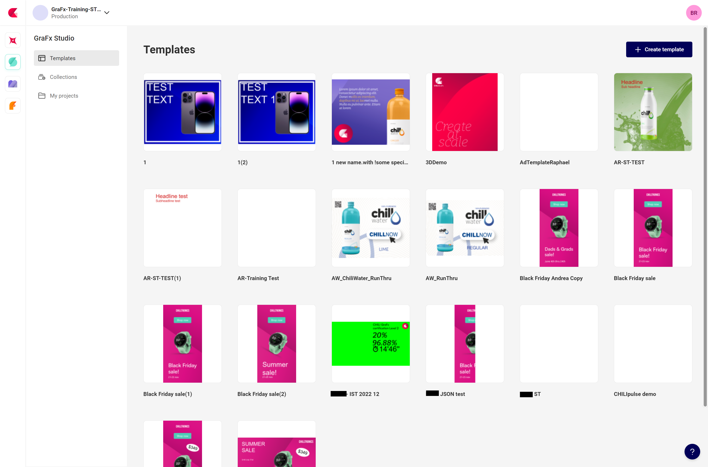
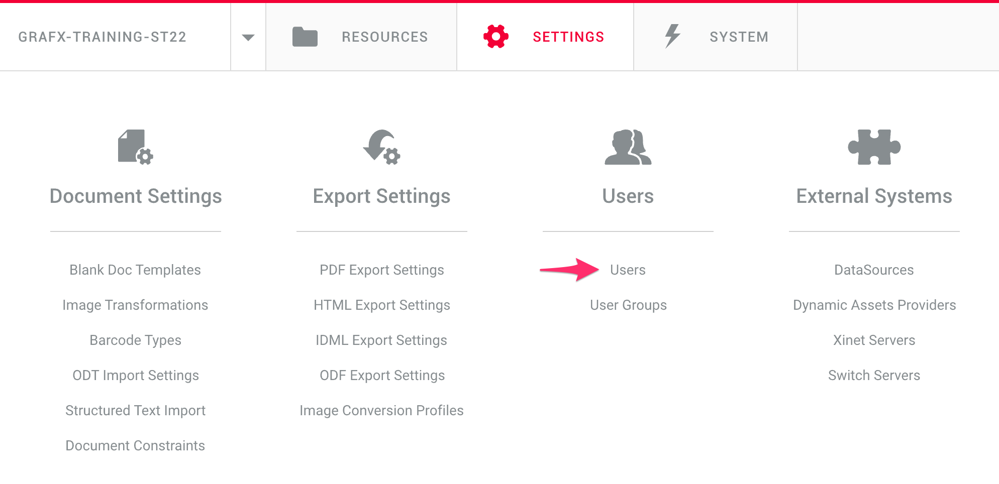
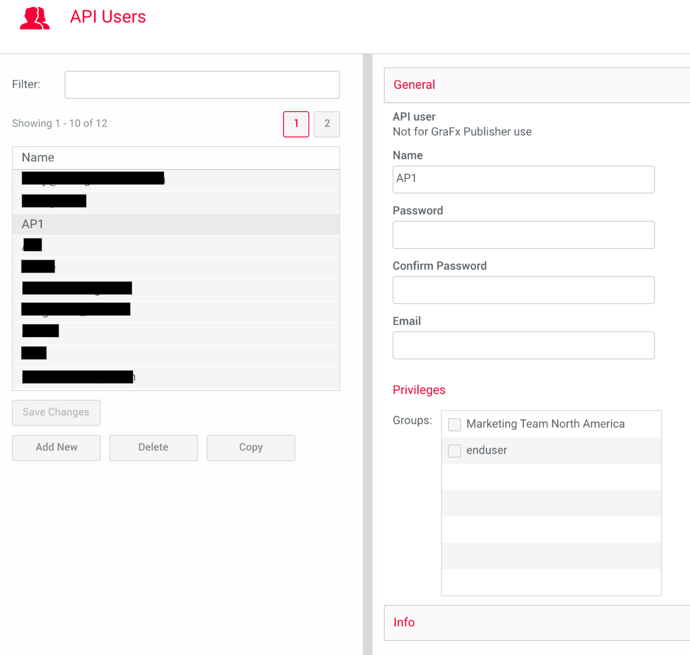
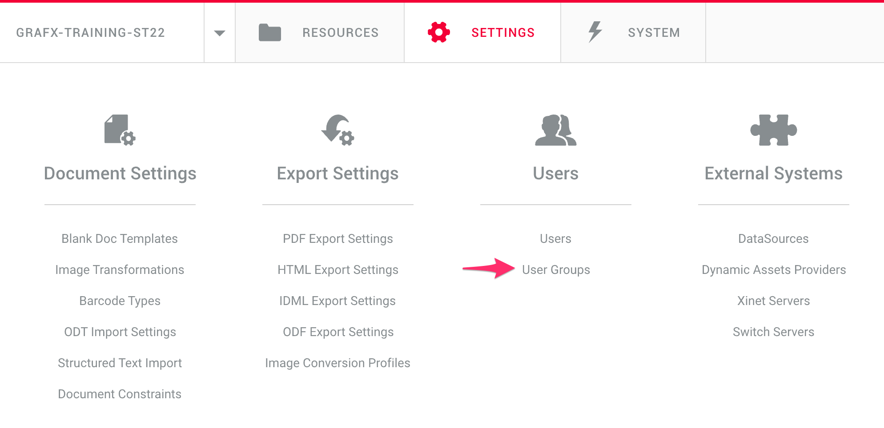
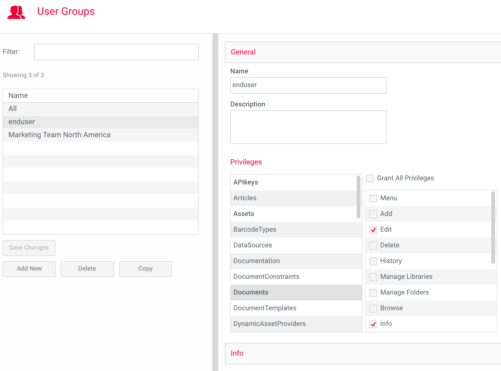

# User management transition

## Introduction

We are transitioning "User management" from the current Applications (like GraFx Publisher) to the CHILI GraFx Platform.

User management for the new Applications (like GraFx Studio, GraFx Media, ...) are all handled in the CHILI GraFx platform.

The CHILI GraFx platform is the place to create users. Human users (people) and API users. 

Except API users for GraFx Publisher.

**API users for GraFx Publisher (only)** need to be created following the information below.

!!! Important
	Creating API users for the platform or your environment, will be available soon in CHILI GraFx.

## API users vs Human users

When we refer to "**human**" users, we are referring to the people (you) who will be using CHILI GraFx directly through the user interface (UI) that has been designed for people. You will be able to navigate through the various features, input data, and receive feedback from the system based on your actions.

On the other hand, **API users** are not human users, but rather computer programs or systems that interact with the software application through its application programming interface (API). API users are typically used in systems that want to access the functionality of the platform programmatically, rather than through a graphical user interface (GUI). API users can send requests to the application's API, which will then return responses with the requested data or perform the requested actions.

## GraFx Publisher API users

When logged in into CHILI GraFx, you cannot add API users for GraFx Publisher.

API (also known as Machine to Machine - M2M in short) users are necessary to create integrations with your application and GraFx Publisher.

To create API users in GraFx Publisher, log in with your original credentials into GraFx Publisher.

### Original URL

Your original URL will look like this (this one won't work, it's about the structure)

https://cp-[abc]-[123].chili-publish.online/cp-[abc]-[123]/interface.aspx

### CHILI GraFx

When logged in through GraFx Publisher, you'll see this URL:

https://chiligrafx.com/environments/[some-number]/publisher

## Create a GraFx Publisher API user

To create API users, you need to login via the original URL.

If you logged in via the right URL, you'll see this:

Continue with "Users" and create the "API" user. We called it "AP1" but feel free to give the user a different name.

Now link your API user with the user groups you need.

### Create a GraFx Publisher Group

When logging into Publisher you'll see this:

Continue with "User groups" and create a group. We called it "end user". Then select the permission categories and individual permissions you users will need.

Please note these groups are specific for CHILI GraFx Publisher and work for API users for Publisher.

### Note for Chili-Publish Online customers

We have removed the OLD checkbox "Environment Administrator" from the Publisher interface.

If your API users need to have all of the permissions in the environment, you can create a group (you can call it "Environment Administrator"), set all of the privileges to that group, and use this group as you would use the checkbox.