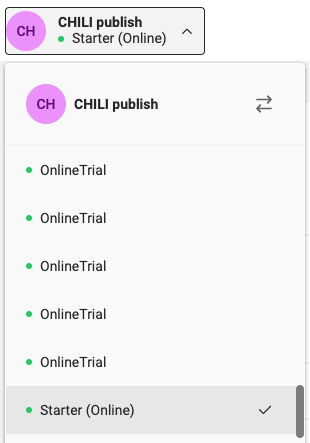
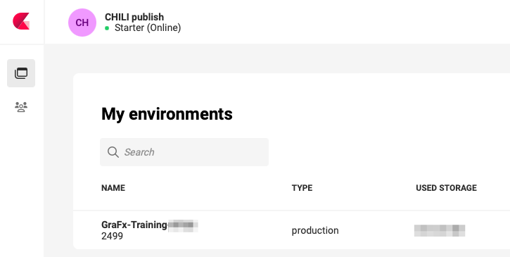
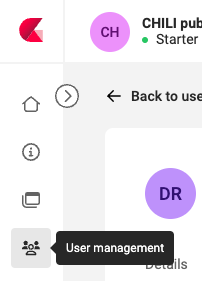
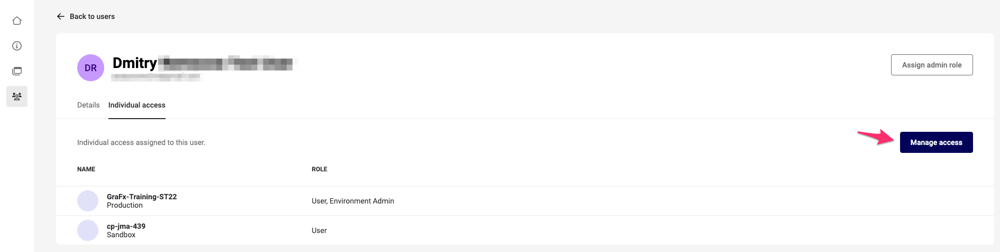
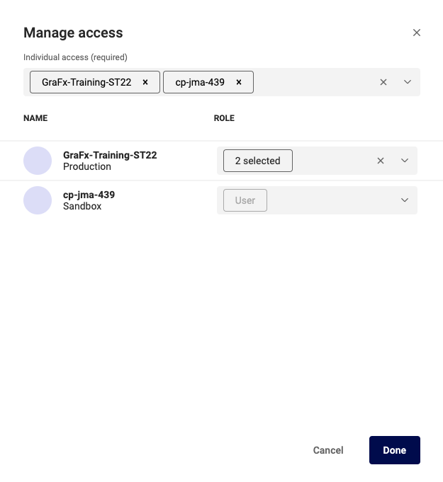

# User management

## Change role & access

### Subscription Admin

If you have access to  multiple subscriptions, first select the subscription where you want to make changes.

If you have acces to only 1 subscription, you will see your subscription only. (without dropdown icon)

### Environment Admin

As Environment admin the process is similar. But you won't need to choose a subscription. And you only see the subscriptions you have access too.

If you don't see an environment you should see, please contact your Subscription Admin, to provide you access to other environments.

### Changing access and role

Go to User Management

Select the user you want to change, and select the tab "Individual access"

Click "Manage access"

In the "Individual access" field, add / remove Environments.
For each environment in the list, assign / remove roles in the list below.

Click the role dropdown, and assign or remove the role for that environment.

The "User" role is default, and cannot be removed.

