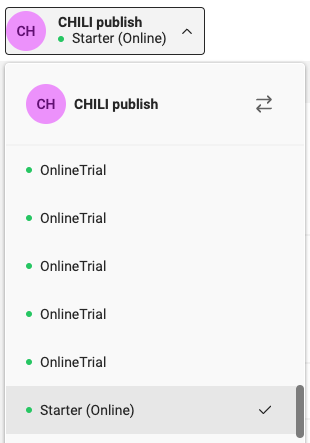
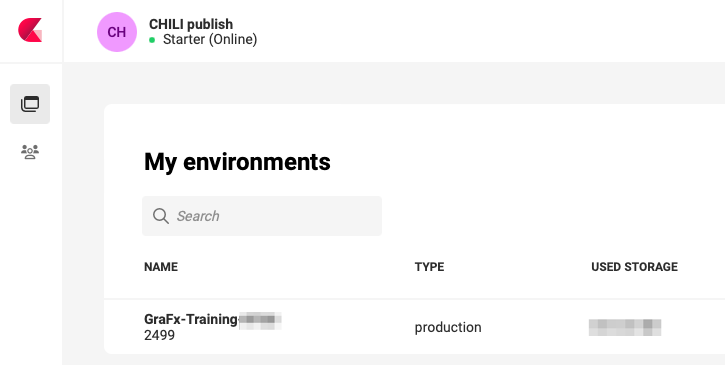
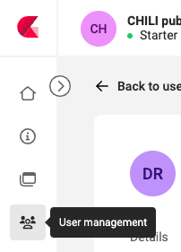
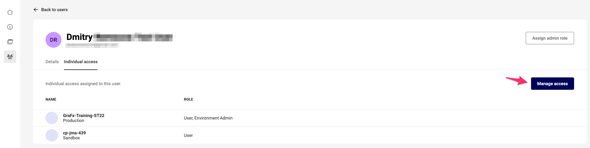
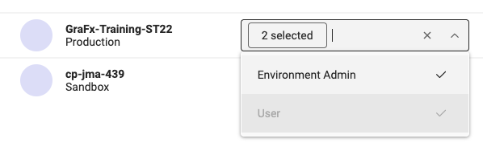

# User management

## Change role & access

### Subscription Admin

If you have access to  multiple subscriptions, first select the subscription where you want to make changes.

{.screenshot}

If you have access to only one subscription, you will see your subscription only (without the dropdown icon).

{.screenshot}

### Environment Admin

As Environment admin the process is similar, but you won't need to choose a subscription. You only see the subscriptions you have access to.

If you don't see an environment you should see, please contact your Subscription Admin to provide you access to other environments.

### Changing access and role

Go to User Management

{.screenshotsmall}

Select the user you want to change, and select the tab "Individual access"

{.screenshot}

Click "Manage access"

{.screenshot-full}

In the "Individual access" field, add / remove Environments.
For each environment in the list, assign / remove roles in the list below.

{.screenshot}

{.screenshot}

Click the role dropdown, and assign or remove the role for that environment.

The "User" role is default, and cannot be removed.

{.screenshot-full}
