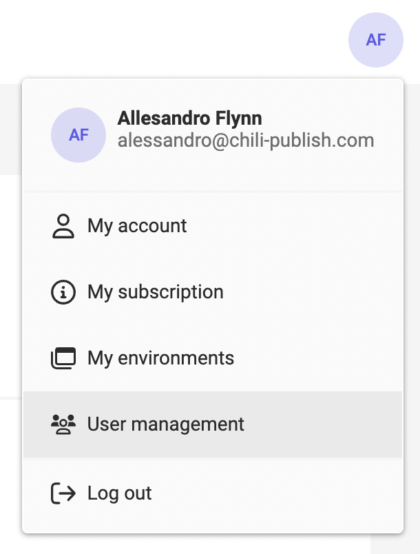
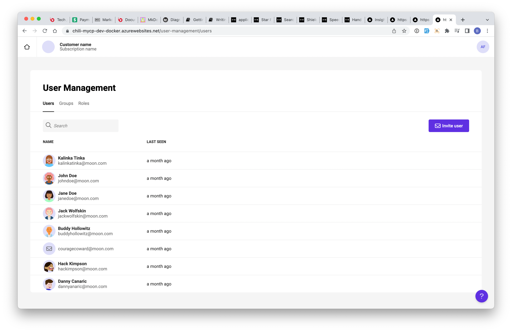
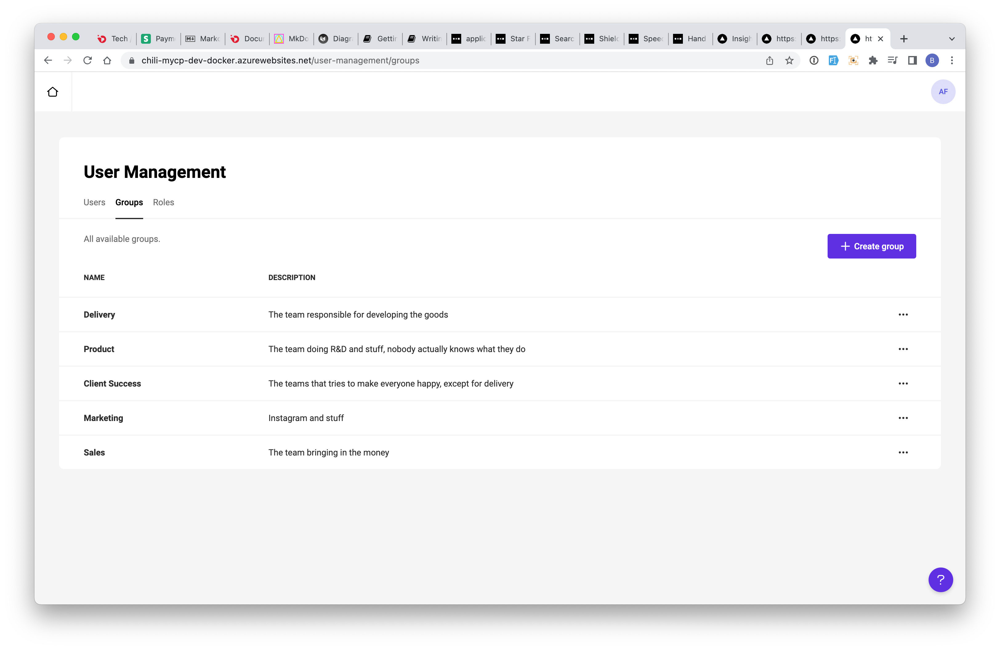
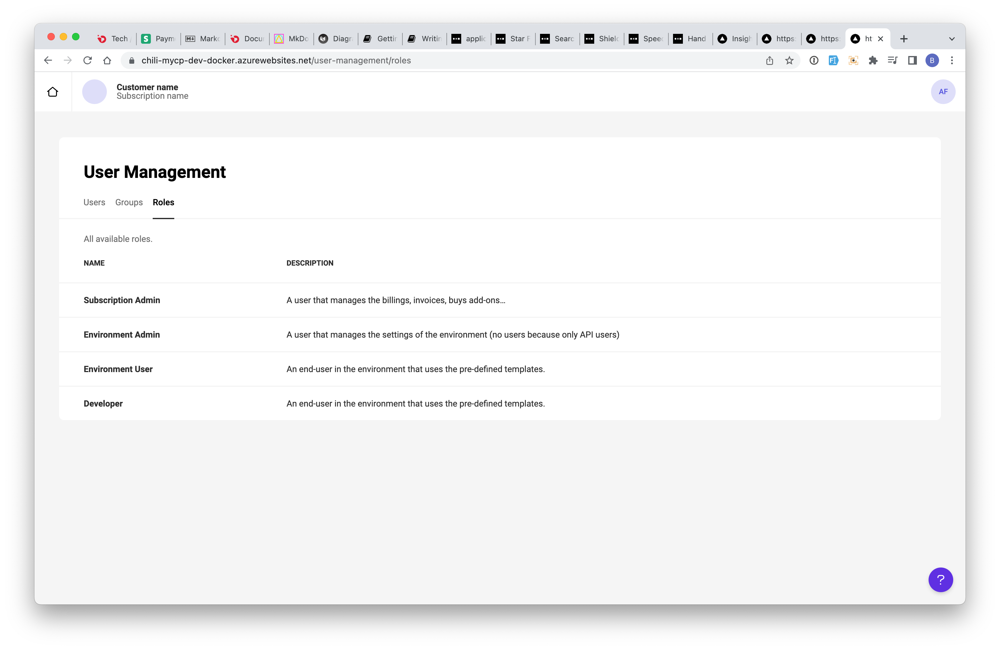

# CHILI GraFx platform administration

Account & Platform administration can be found under the dropdown in the icon on the top right.

## My account

### View account details

The central place to see and update your account details.

Click on the avatar, to choose a new picture for your account

### Reset my password

You would only need to reset your password, if it got compromised.

Password have a lifecycle of 1 year, after that you'll be invited to create a new password.

## Subscriptions

Your account can hold 1 or more subscriptions. Choosing "My subscriptions" in the account drop down, will display a dashboard of the first active subscription.

If you have more than 1 subscription, you can change subscriptions in the dropdown next to the home button.

### Analytics about my subscription

## Environments

### Environment overview

## User management

!!! note

	Quick reminder: the concept is users has changes since My CP. Now users from My CHILI publish (mycp), CHILI publisher (online) and API users are combined in CHILI GraFx users.

To start go to Account > User management

### Users

A full list of users (Account, Application, API, ...) is available on the User Management page.

### User groups

Groups provide a way to provide the same functionality, to a list of people in the same group.

### User roles

A roles defines what a user can do. 

4 Roles have been pre-defined in CHILI GraFx

- Subscription Admin
- Environment Admin
- Environment User
- Developer

