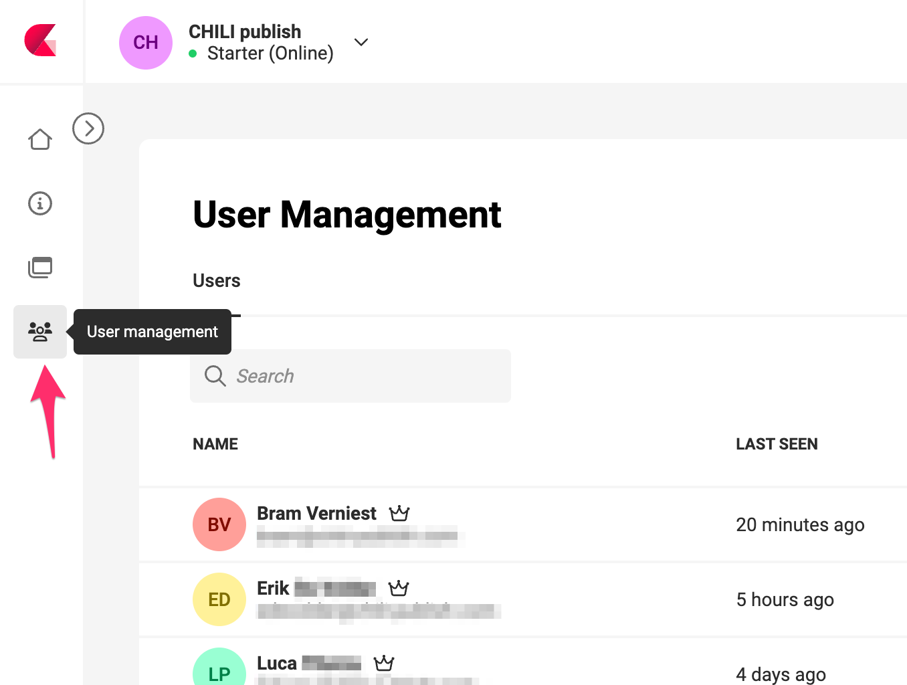
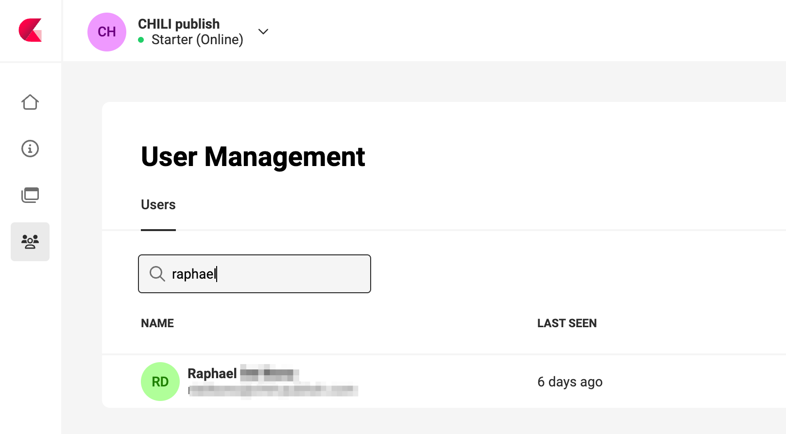
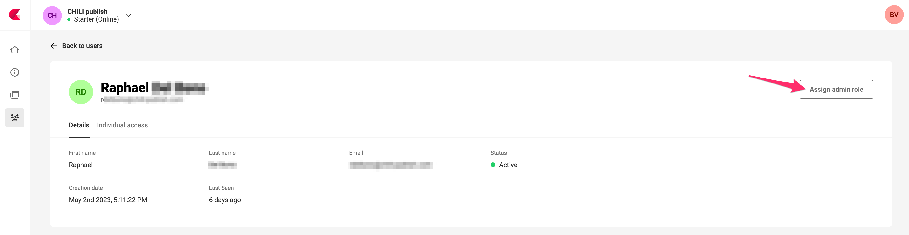
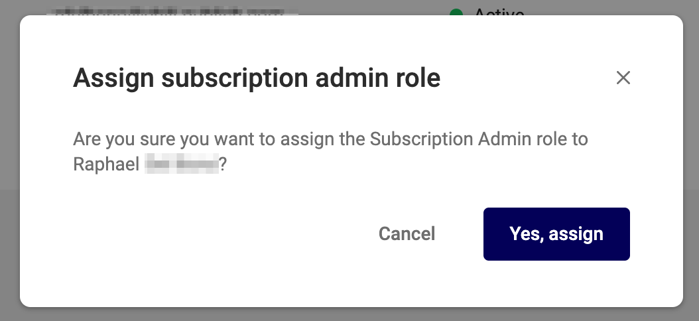
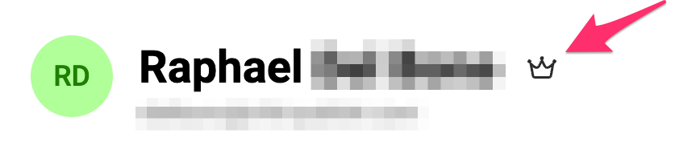
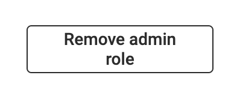
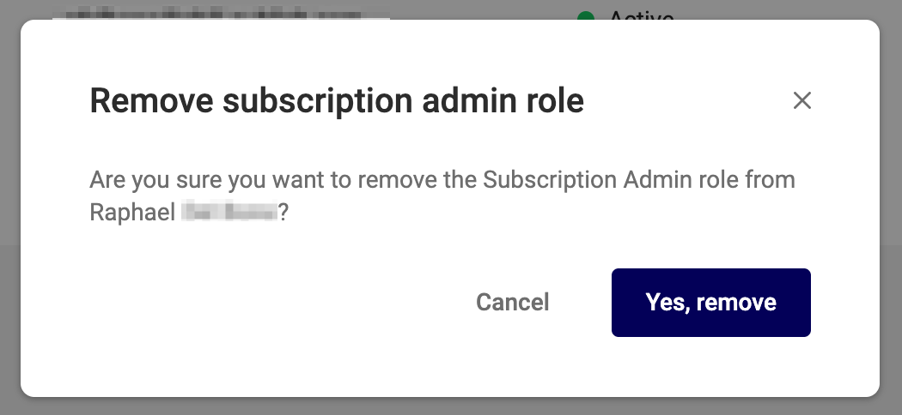

# Subscription Administrator

## Prerequisites

To assign or remove the role of Subscription admin, you need to be a "Subscription Admin" yourself.

## Assign Subscription Admin role

In your subscription, go to "User management".

Find and click on the respective user, you want to assign the Subscription Admin role to.

Click on the "Assign admin role" button, on the right.

Confirm the action

The user will have a "Crown" icon, next to the name.

## Remove Subscription Admin role

To remove the role, go to the user, and click the "Remove Admin role" button

Confirm the action

