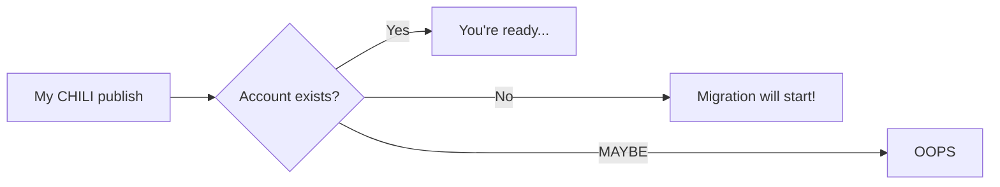

# Migration from My CHILI publish

## Migrate?

Your account was part of the My CHILI publish portal. 

CHILI GraFx is a platform, and is capable of hosting applications. And next to hosting applications, the platform also offers the opportunity to have resources shared amongst applications.

Therefore your account(s) need to migrate from MyCP to CHILI GraFx.

    
### Phase 1

In the first phase, your MyCP account will be migrated

### Phase 2

When phase 2 goes live, your CHILI publisher (backoffice) accounts will also migrate to CHILI GraFX.
The roles and functionality will be respected and mapped to new CHILI GraFx users.

### Phase 3

You will be able to connect third party Identity Providers to CHILI GraFx

## Step 1: Confirm you want to start the wizard

Loggin on to CHILI GraFx will bring you to this screen

## Step 2: Provide your email

Provide your email, you used to login to My CHILI publish before.

If you use an email that is in use, you will get notified.

If your email is known in the platform, CHILI GraFx will let you know.

## Step 2: Confirm your email

A confirmation email awaits you, and will bring you to the activated CHILI GraFx dashboard.