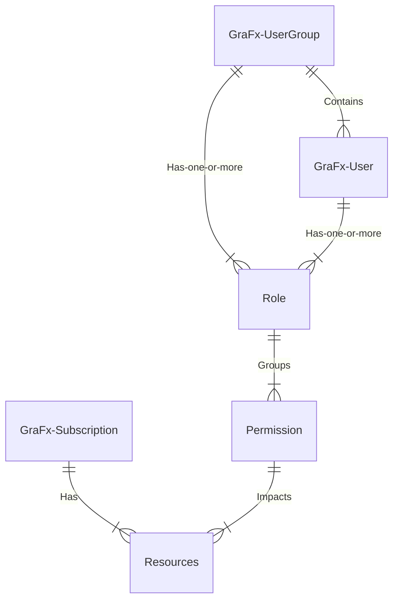
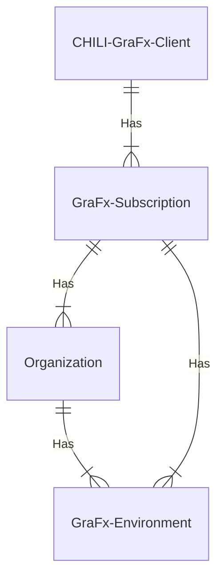

# User management

## Introduction

5 Basic concepts define the user management. Below you can find the details of each concept.

### Relation between concepts

### Resources

!!! Definition
	Any item that will be impacted by the user management system.
	
Let's start with resources, since they are the items undergoing the effect of permissions. All levels of over management will have an effect on resources in the Platform.

Sample resources: GraFx Media assets, GraFx Documents, Users, Environments

### GraFx Users

!!! Definition 
	A Person or system identified by a username that performs an operation over the resource
	
We defined a GraFx User as a person or a system. In many cases you will interact as a human with the GraFx UI. 

In some cases, you'll also need a system user, that can be used to interact with the GraFx API's. It's wise to unlink this system user from a person. In case the human user changes jobs or roles, you don't need to redefine the access or role for the system user.

### GraFx UserGroup

!!! Definition
	A list of 1 or more users, sharing the same role(s)

A group of users allows you to easily give the same role(s) to all the users in that group. 

All roles associated with a group of users will be associated with all members of the group

### permissions

!!! Definition
	The authorization to perform an operation over a resource. 
	
Sample permissions: 

create, read, update, delete an asset

create, read, update, delete a user

create, remove an environment

In order to be able to perform an action over a resource, the user needs to have the permission to do so.

Permissions in CHILI GraFx will never be assigned on an individual level, but allways be combined in a role.

### Roles

!!! Definition
	A set of permissions that eases the management of permissions to users or groups. Allows assigning multiple permissions to a user or a group of users without making individual assignments

## Scope of permissions

The scope of the permissions is the concept that not all permissions have the same impact. Some permissions have impact on a different leven.

The schema below shows the relation between the levels in a CHILI GraFx Subscription, to then explain the impact of permissions (roles) on these levels

### A GraFx Subscription

Roles defined on the Subscription level, have permission with impact for all environments.
These contain operations like managing the lifecycle of identities and environments.

### Organization

An organizaion is an optional grouping you can define. An organization groups 1 or more environments.

Roles at the organization level, have impact on all environments in this organization.

### Environment

An environment is the smallest level, where documents are grouped to serve an application. The minimum restriction you can apply to a set of resources, is the environment level.

Roles (and permissions) on the environment level affect only the specific environment.

## Available roles

### Subscription Admin

!!! Definition
	A Subscription Admin manages the subscription(s) he is assigned too
	
Assigned permissions

- View all their subscription(s) assigned to
- View usage reporting
- View subscription details
- View overview of all the environments in a subscription
- Request add-ons (eg. extra storage)-
- Directly contact their Client Success Manager
- User management for all users in the subscription (CRUD actions)

??? Warning "Subscription Admin"
	Important: a Subscription Admin can assign the role ‘Subscription Admin' to other users on 'User Detail page', but only for subscriptions he is assigned to.

### Environment Admin

!!! Definition
	An Environment Admin manages the CHILI GraFx environment(s) where he is assigned to by his Subscription Admin
	
Assigned permissions

- Access to environments where you are Environment Admin
- View overview of all the environments where you are Environment Admin
- Manage the CHILI GraFx environment where you are Environment Admin
	- Environment Settings (eg. branding)
	- User management (CRUD actions) for the users of environments where you are Environment Admin
	
??? warning "Environment Admin vs Environment User"
	If an Environment Admin wants to actually work in the CHILI GraFx environment he needs to have an additional role (Environment User)

### Organization Environment Admin

!!! Definition
	An Organization Environment Admin manages a group of CHILI GraFx environments that belong to an organization and where a user is assigned to by the Subscription Admin

!!! Warning
	Further to be defined

### Environment User

!!! Definition
	An Environment User works as an end-user in the CHILI GraFx environment(s) where you are assigned to.

Assigned permissions

- Access to the environments the user is assigned to
- View overview of all the environments where the user is Environment User
- Work in the environments where the user is assigned to

!!! Warning "Template Designer"
	- If an Environment user wants to create templates in the CHILI GraFx environment this user needs to have an additional role: Template Designer
	- If an Environment users wants to create workspaces in the CHILI GraFx environment the user needs to have an additional role: Workspace Admin

### Template Designer

!!! Definition
	A Template Designer can create templates in the CHILI GraFx environments where the user is assigned to
	
Assigned permissions

- View templates
- Create templates
- Update templates
- delete templates

!!! Warning "Different permissions then Environment user"
	- Different permissions than Environment User 
	- The Template Designer has to be assigned on the Subscription Management page since this role is an paying add-on
	- A Template Designer is assigned on Subscription Level and gives this user access to all the environments of that subscription
	- To use the Desktop plugins you don’t need a template designer seat: importing content in GraFx Publisher or GraFx Studio doesn’t require a template designer seat but making the templates smart does require a seat.
	
Template designer seats (role) is assigned on the Subscription page

### Workspace Admin

!!! Definition
	A Workspace Admin can create workspaces in the CHILI GraFx environment where he is assigned too.

Assigned permissions

- CRUD actions on workspaces

!!! Warning "Different than Environment user role"
	Not same permissions as Environment User 

### Support User - [UNCLEAR]

!!! Definition
	A Support User can access the [support portal of CHILI GraFx](http://mysupport.chili-publish.com){target="_blank"}

### Documentation User

!!! Definition
	By default, all users have access to all documentation.
	Documentation will be open for public, except some restricted sections. All users in CHILI GraFx also get access to the restricted pages.

### Developer User [UNCLEAR]

## User creation and invitation

### First user

The first user will be the subscription Admin, and is created by CHILI GraFx, as a result of a signed contract.

### Subsequent Users

All users (except the first (subscription Admin) user) can be invited to CHILI GraFx by

- A Subscription Admin
- An Environment Admin

Only the Subscription Admin & the Environment Admin can access the User Management page on CHILI GraFx where they can:

- view an overview of the users
- view an overview of the Groups
- view an overview of the roles on CHILI GraFx
- invite users to CHILI GraFx

## Migration

If you had a CHILI publisher Online subscription before, a migration tool will convert the users into CHILI GraFx users.

Since the permission setup is different, there will be no 1/1 mapping.
During Phase 1 - Timeframe [UNCLEAR] - all users will be converted as Subscription Admin. This will enable the application to keep working.
It's up to the Subscription Admin (first user) to assign new CHILI GraFx roles to these converted users.

In a second phase - Timeframe [UNCLEAR] - a smart mapping of the permissions will take place.

## Scenarios

The description above explains the theory. Below are some examples how to organize your users, based on your profile.

### Brand Owner

As the owner of the access to CHILI platform, you will have the Subscription Admin access.

How you organize the other levels will depend on your organization.

The main thought process is: who needs access to one or more resources, and how do I combine or separate these resources?

**Example 1**: Brand-owner with 1 brand/product.

All resources stored into 1 Environment.

Environment Admin is the Brand Manager, or whoever is responsible for managing the brand assets (smart templates)

End-users are the consumers of the templates, able to make publications.

**Example 2**: Brand-owner with multiple brands, available worldwide

Environment Admin is the brand manager, responsible for the group of smart templates, related to his/her group of brands.

End-users are the consumers of the templates, able to make publications.

**Example 3**: Brand-owner with several brands, and regional management/ownership of these products.

Environment Admin is the brand manager, responsible for the group of smart templates, related to his/her group of brands.

The end-users are the brand-managers for 1 or more groups of products, grouped in 1 environment.

Setup Environments as (regional) product groups, and organize access via Environments.

### Solution Provider (no access to end-customers)

### Solution Provider (access to end-customers)