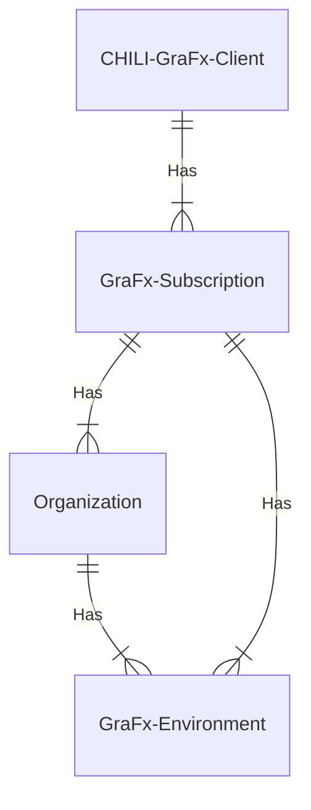

# User management

## Scope of permissions

The scope of the permissions is the concept that not all permissions have the same impact. Some permissions have impact on a different leven.

The schema below shows the relation between the levels in a CHILI GraFx Subscription, to then explain the impact of permissions (roles) on these levels

### A GraFx Subscription

Roles defined on the Subscription level, have permission with impact for all environments.
These contain operations like managing the lifecycle of identities and environments.

### Organization

An organizaion is an optional grouping you can define. An organization groups 1 or more environments.

Roles at the organization level, have impact on all environments in this organization.

### Environment

An environment is the smallest level, where documents are grouped to serve an application. The minimum restriction you can apply to a set of resources, is the environment level.

Roles (and permissions) on the environment level affect only the specific environment.

## Available roles

### Subscription Admin

!!! Definition
	A Subscription Admin manages the subscription(s) he is assigned too
	
Assigned permissions

- View all their subscription(s) assigned to
- View usage reporting
- View subscription details
- View overview of all the environments in a subscription
- Request add-ons (eg. extra storage)-
- Directly contact their Client Success Manager
- User management for all users in the subscription (CRUD actions)

??? Warning "Subscription Admin"
	Important: a Subscription Admin can assign the role ‘Subscription Admin' to other users on 'User Detail page', but only for subscriptions he is assigned to.

### Environment Admin

!!! Definition
	An Environment Admin manages the CHILI GraFx environment(s) where he is assigned to by his Subscription Admin
	
Assigned permissions

- Access to environments where you are Environment Admin
- View overview of all the environments where you are Environment Admin
- Manage the CHILI GraFx environment where you are Environment Admin
	- Environment Settings (eg. branding)
	- User management (CRUD actions) for the users of environments where you are Environment Admin
	
??? warning "Environment Admin vs Environment User"
	If an Environment Admin wants to actually work in the CHILI GraFx environment he needs to have an additional role (Environment User)

### Organization Environment Admin

!!! Definition
	An Organization Environment Admin manages a group of CHILI GraFx environments that belong to an organization and where a user is assigned to by the Subscription Admin

!!! Warning
	Further to be defined

### Environment User

!!! Definition
	An Environment User works as an end-user in the CHILI GraFx environment(s) where you are assigned to.

Assigned permissions

- Access to the environments the user is assigned to
- View overview of all the environments where the user is Environment User
- Work in the environments where the user is assigned to

!!! Warning "Template Designer"
	- If an Environment user wants to create templates in the CHILI GraFx environment this user needs to have an additional role: Template Designer
	- If an Environment users wants to create workspaces in the CHILI GraFx environment the user needs to have an additional role: Workspace Admin

### Template Designer

!!! Definition
	A Template Designer can create templates in the CHILI GraFx environments where the user is assigned to
	
Assigned permissions

- View templates
- Create templates
- Update templates
- delete templates

!!! Warning "Different permissions then Environment user"
	- Different permissions than Environment User 
	- The Template Designer has to be assigned on the Subscription Management page since this role is an paying add-on
	- A Template Designer is assigned on Subscription Level and gives this user access to all the environments of that subscription
	- To use the Desktop plugins you don’t need a template designer seat: importing content in GraFx Publisher or GraFx Studio doesn’t require a template designer seat but making the templates smart does require a seat.
	
Template designer seats (role) is assigned on the Subscription page

### Workspace Admin

!!! Definition
	A Workspace Admin can create workspaces in the CHILI GraFx environment where he is assigned too.

Assigned permissions

- CRUD actions on workspaces

!!! Warning "Different than Environment user role"
	Not same permissions as Environment User 

### Support User - [UNCLEAR]

!!! Definition
	A Support User can access the [support portal of CHILI GraFx](http://mysupport.chili-publish.com){target="_blank"}

### Documentation User

!!! Definition
	By default, all users have access to all documentation.
	Documentation will be open for public, except some restricted sections. All users in CHILI GraFx also get access to the restricted pages.

### Developer User [UNCLEAR]