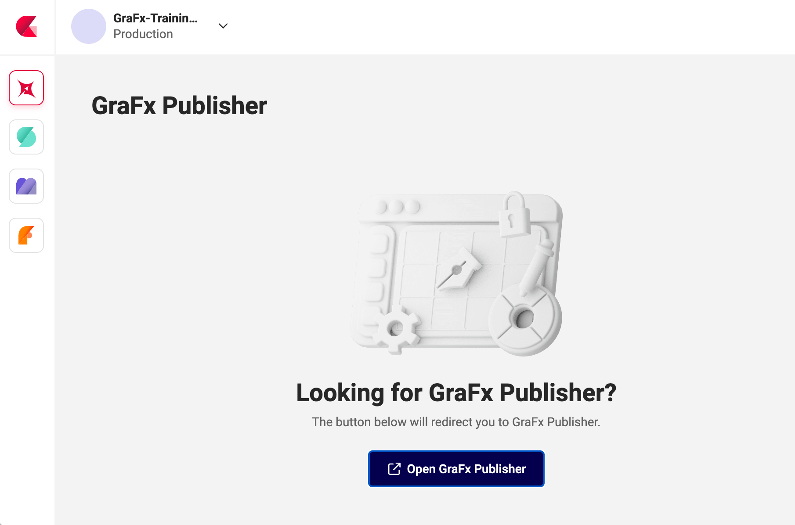
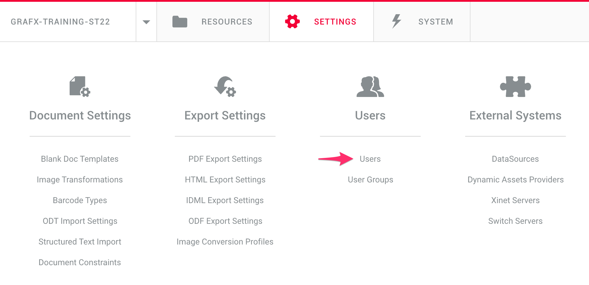
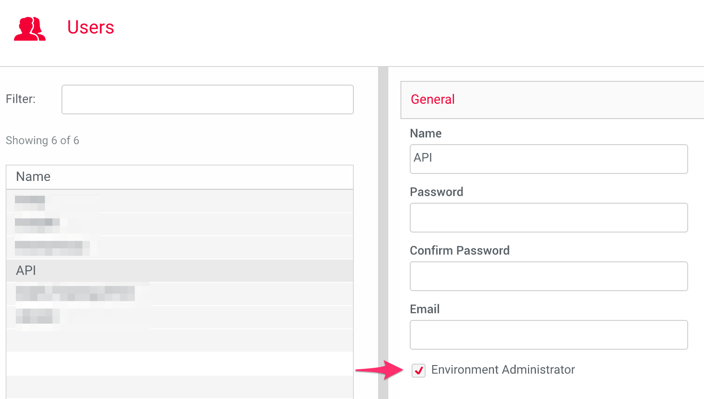

# User management transition

!!! warning "Temporary information"
	
	While integrating CHILI publisher into CHILI GraFX, now calling it GraFx Publisher, there are some steps we need to take during this transition phase.
	
	Update 2023-05-01

## One API user to rule them all

In the end (after the transition period) there will be 1 location to create and manage API users: CHILI GraFx.

You will be able to create "human" users, and API users (or machine-to-machine users).

**But** ...

During this transition, **API users for GraFx Publisher (only)** need to be created following the information below.

## GraFx Publisher API users

When logged in into CHILI GraFx, you cannot yet add API or M2M users for GraFx Publisher.

API or Machine to Machine (M2M) users are necessary to create integrations with your application and GraFx Publisher.

To create API users in GraFx Publisher, log in with your original credentials into GraFx Publisher.

### Original URL

Your original URL will look like this (this one won't work, it's about the structure)

https://cp-[abc]-[123].chili-publish.online/cp-[abc]-[123]/interface.aspx

### CHILI GraFx

When logged in through GraFx Publisher, you'll see this URL:

https://chiligrafx.com/environments/[some-number]/publisher

## Create a GraFx Publisher API user

To create API users, you need to login via the original URL.

If you logged in via the right URL, you'll see this:

Continue with "Users" and create the "API" user. We called it "API" but feel free to give the user a different name.

Now your API user for Integration with GraFx Publisher is ready.