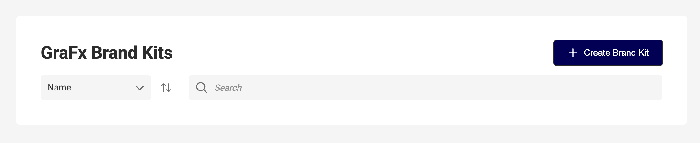
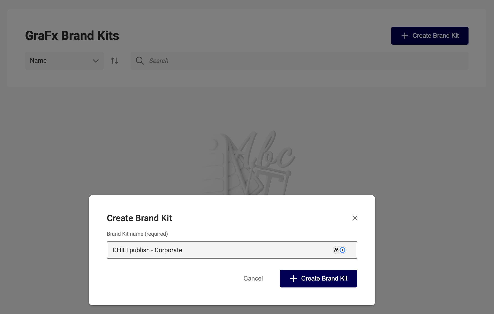
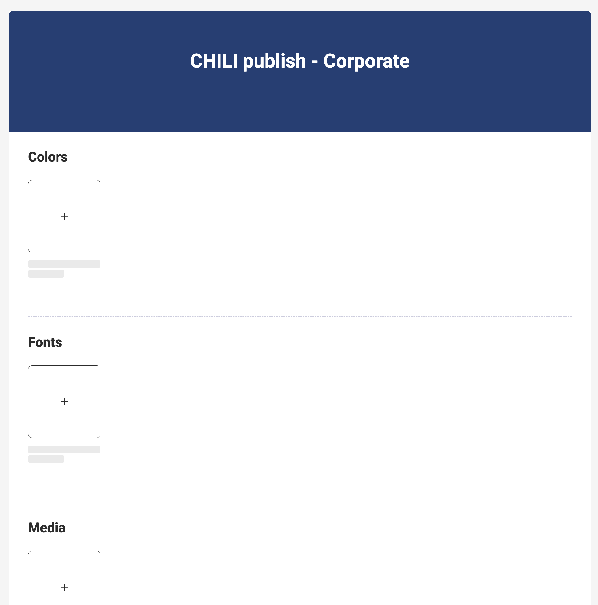

# Create a Brand Kit

1. Navigate to **GraFx Brand Kits** in the platform sidebar.  
2. Click **+ Create Brand Kit**.  

3. Enter a **Name**.

4. Click **+ Create Brand Kit**.  

You’ll be taken to the new Brand Kit’s detail page, where you can begin adding elements.

