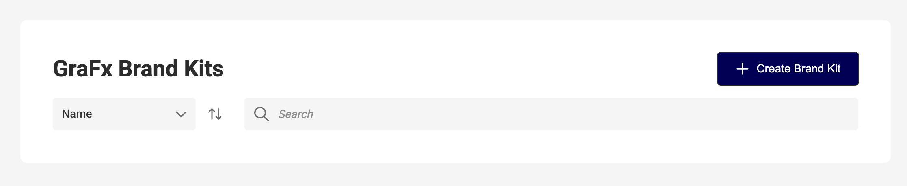
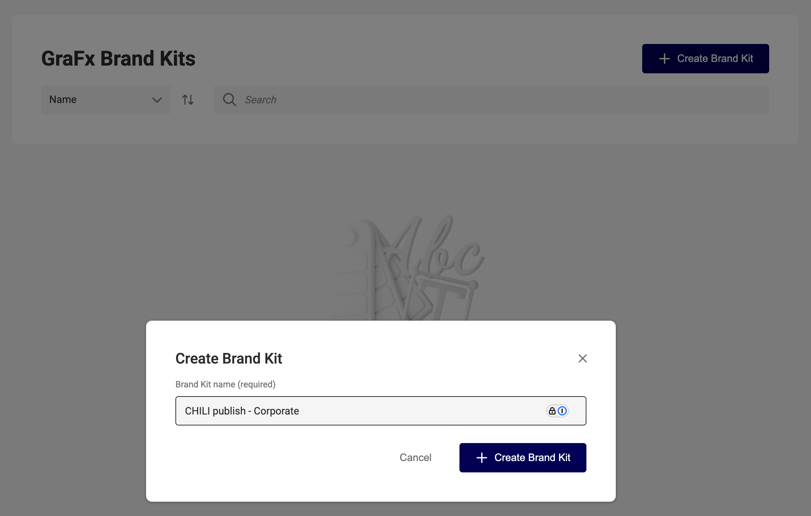
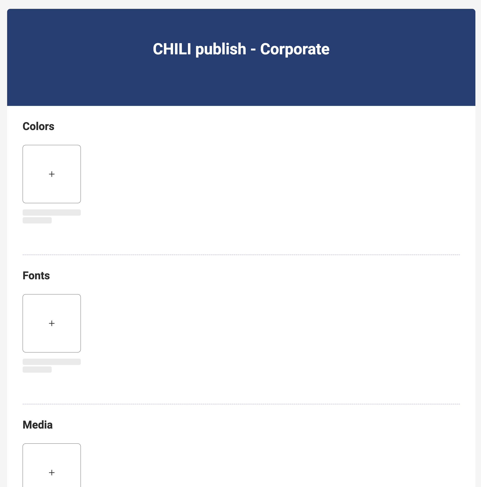

# Create a Brand Kit

<iframe width="690" height="388" src="https://www.youtube.com/embed/3v03CPB6_xs?controls=1&mute=0&showinfo=0&rel=0&autoplay=0&loop=0" title="Create a Brand Kit in GraFx Brand Kits" frameborder="0" allow="accelerometer; autoplay; clipboard-write; encrypted-media; gyroscope; picture-in-picture; web-share" referrerpolicy="strict-origin-when-cross-origin" allowfullscreen></iframe>

[Getting Started with GraFx Studio — full course](https://www.youtube.com/playlist?list=PLOzpLl2aXHcM)

1. Navigate to **GraFx Brand Kits** in the platform sidebar.  
2. Click **+ Create Brand Kit**.  

3. Enter a **Name**.

4. Click **+ Create Brand Kit**.  

You’ll be taken to the new Brand Kit’s detail page, where you can begin adding elements.

