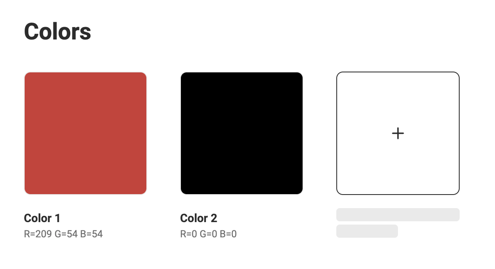
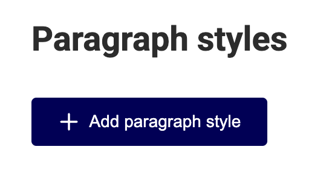
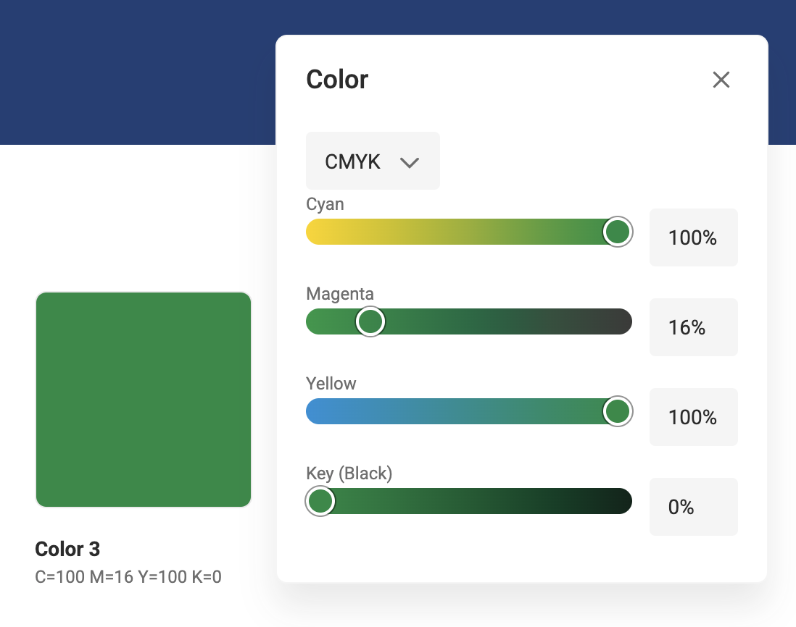
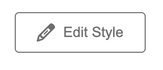
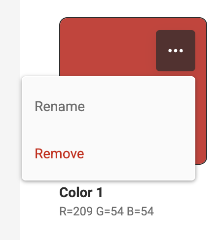

# Update a Brand Kit

On the Brand Kit detail page:

## Add an element

- Click the “+” in the empty tile for Colors, Fonts & Media.

- Click on the "Add" button for Paragraph styles or Character styles.  

- Fill in the required fields or add items.  

## Edit an element

- Colors: Click the color tile and edit the values
- Fonts: Only add and remove fonts is possible
- Media: Only add and remove assets is available
- Paragraph- and Character styles: click the "Edit Style" button

## Remove an element

- Click the "..." menu and select **Remove**

