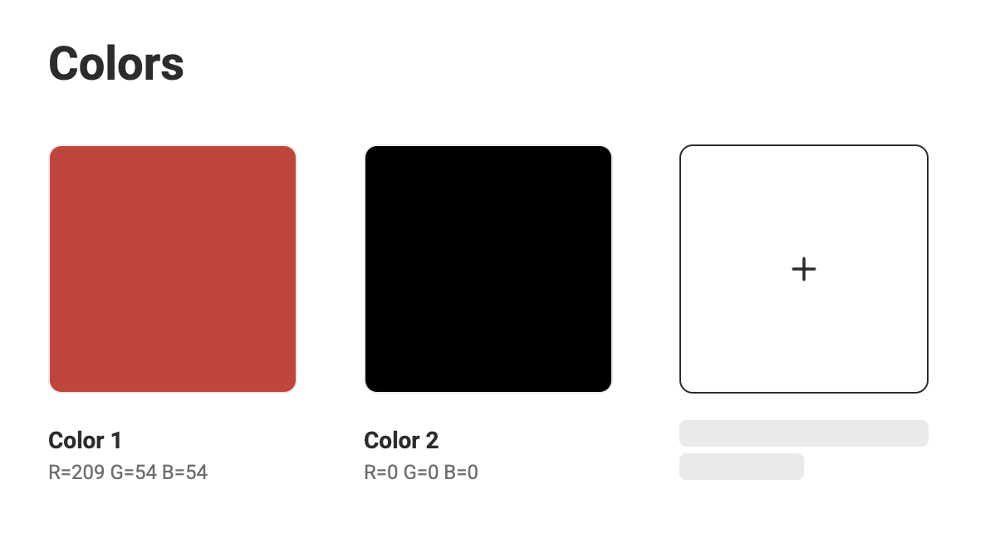
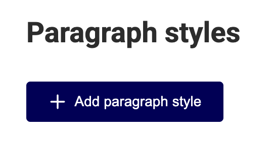
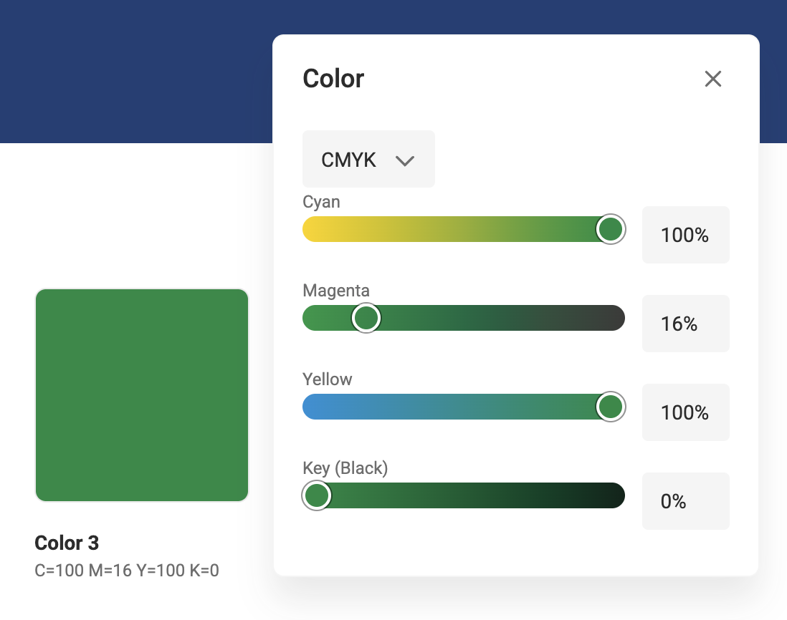
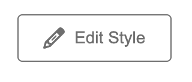
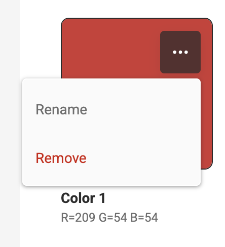

# Update a Brand Kit

On the Brand Kit detail page:

!!! info "Editing themes"
    Your edits apply to the theme selected in the theme bar at the top of the page. On the default theme you edit the Brand Kit itself; on any other theme, changes are saved as overrides on that theme. See [Manage themes](/GraFx-Brand-Kits/guides/themes/).

## Add an element

- Click the “+” in the empty tile for Colors, Fonts & Media.

- Click on the "Add" button for Paragraph styles or Character styles.  

- Fill in the required fields or add items.  

## Edit an element

- Colors: Click the color tile and edit the values
- Fonts: Only add and remove fonts is possible
- Media: Add, remove, or replace assets using the "..." context menu. If an asset has been deleted from GraFx Media, the Brand Kit shows an *"Image not available"* placeholder — use the context menu to replace or delete it.
- Paragraph- and Character styles: click the "Edit Style" button

## Remove an element

- Click the "..." menu and select **Remove**

