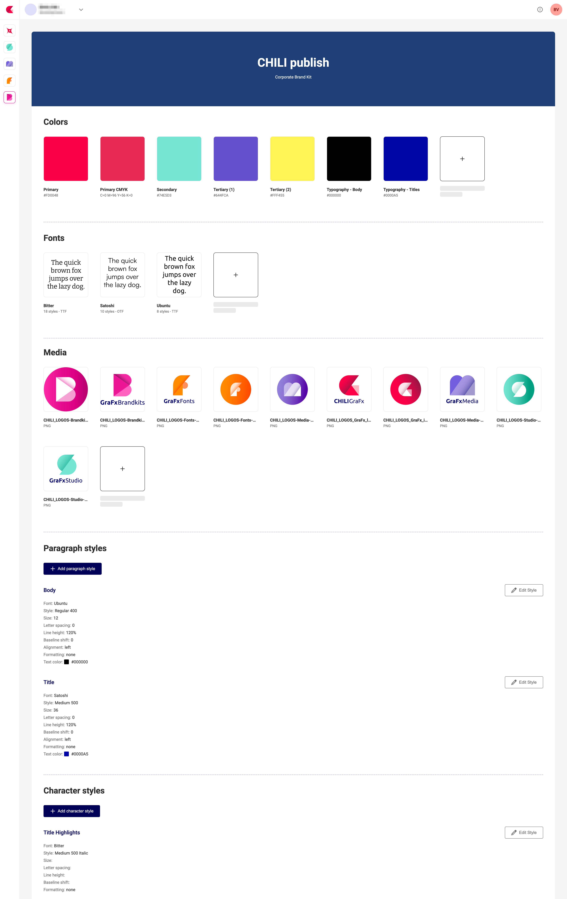

# GraFx Brand Kits

GraFx Brand Kits lets you define and manage your organization’s visual identity in one place. 

Once you’ve set up a Brand Kit, template designers and end users can apply its colors, fonts, images and styles directly in GraFx Studio, speeding up template creation and ensuring brand compliance.

