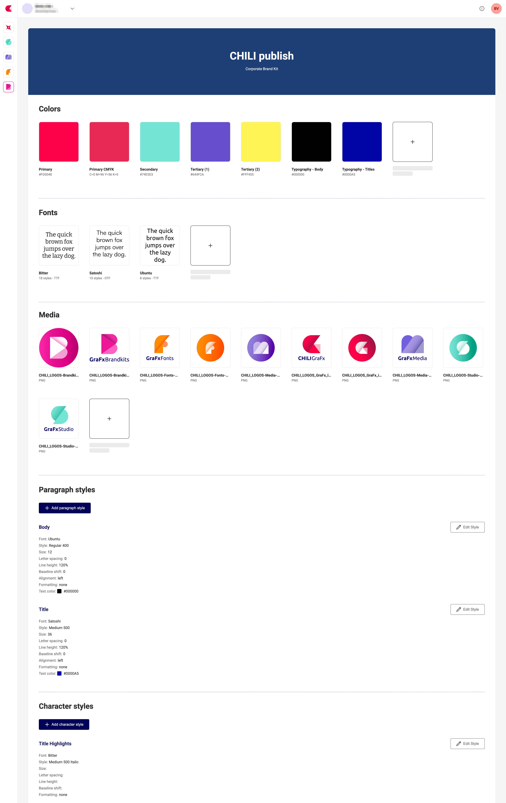

# {.applogo-inline} GraFx Brand Kits

GraFx Brand Kits lets you define and manage your organization’s visual identity in one place. 

Once you’ve set up a Brand Kit, template designers and end users can apply its colors, fonts, images and styles directly in GraFx Studio, speeding up template creation and ensuring brand compliance.

With [themes](/GraFx-Brand-Kits/concepts/themes/), a single Brand Kit can carry variations of the brand — a sub-brand, a print color palette, a regional text style — each theme overriding only what differs from the default.

