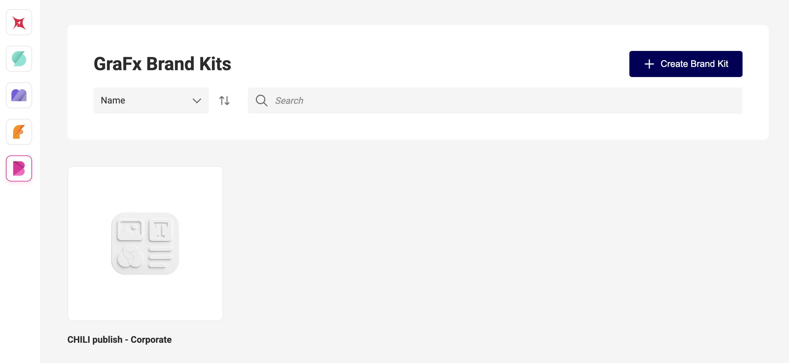

# Application overview

Open the GraFx Brand Kits application

1. **Toolbar**  
   – **Create Brand Kit** button  
   – Search & sort by name  

2. **Brand Kit cards**  
   – Each card shows the kit’s name, description and thumbnail  
   – Click a card to open its details  

