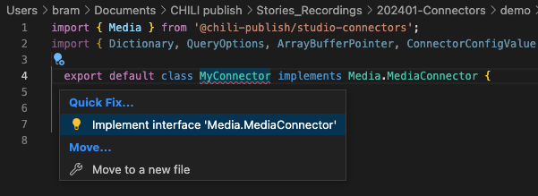

# Guide to building your own Media Connector

## Pre-requisites

- Have 'npm' installed
- Know nodejs
- Have a decent IDE

## Install the CLI

go to (or make) directory, where you want to start making your connector  
e.g. "/Users/<yourname>/mediaconnector-mydam"

Install the command line tools. This will help you to install, build and deploy your Media connector.

``` csh
npm install -g @chili-publish/connector-cli
```

You can now execute the command (in the terminal, in the right directory)

To understand what the CLI can do, you can now execute
This will give you an overview of the available commands

``` csh
npx connector-cli
```


Initialize: Means building the Boiler Plate. This is the basic code you'll need to get started.

``` csh
npx connector-cli init
```

You now have the basic code. In that code, we have defined some dependencies. To download these, execute the install command.


``` csh
npm install
```

Now it's time to create your custom code.

This happens in the file "connector.ts". This is a typescript files.

By default, there will be not implementations. Your ID will show a message (if it's a good IDE, wont' be notepad)



You can fix this, by applying the quick fix "Implement itnerface 'Media Connector'"

The code will be added with all the functions that needs to be implemented.

## Building

If your code works (syntax), it will build.
Therefore you need to give the command to build with npx.

``` zsh
npx connector-cli build
```

## Debugging

To test the functionality, we provide you with a mini webserver, that will open up the result of your code in a web browser.

There you can test the implementation.

``` zsh
npx connector-cli debug
```

## Capabilities

Our framework supports the capabilities.

You need to enable them, to expose them to the end-user.

## Publish your result

Once ready, it's time to publish your connector to your environment.

Before you can do that, you'll need to login.

Our CLI tool provides a way to authenticate, via the browser.

``` zsh
npx connector-cli login
```

when that is done, you can bow publish.

``` zsh
npx connector-cli publish -e <environment> -b <base url> -n <connector name>
```