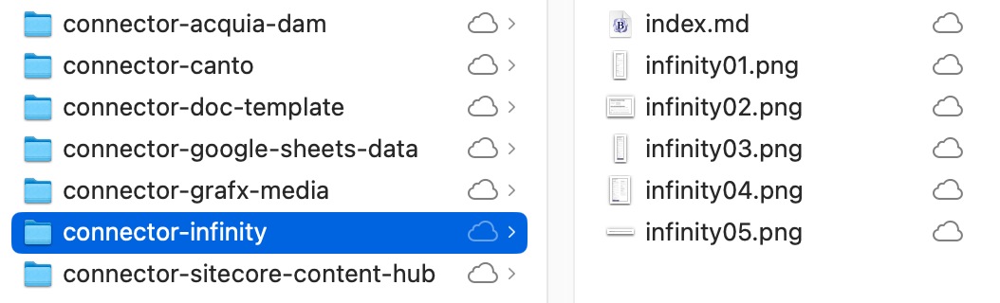
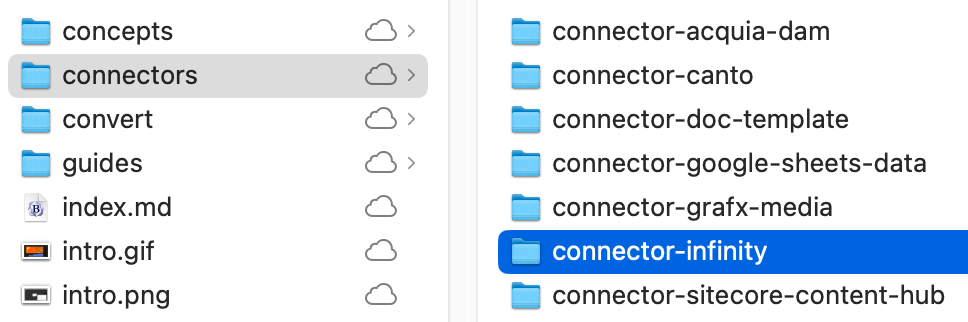
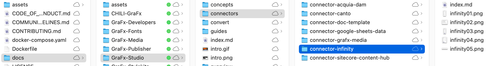
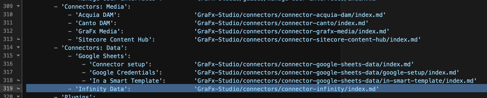

# Connector Documentation

## Introduction

Built a connector? Great job.

Next step: document it for your users.

See the [Google Sheets Data Connector](/GraFx-Studio/connectors/connector-google-sheets-data/) for inspiration. It explains:

- How to deploy from Connector Hub
- How to set up (auth, credentials, etc.)
- How to use in a Smart Template

## How to Start

1. Read the [README](https://github.com/chili-publish/grafx-documentation/blob/main/README.md) and [Contributing Guide](https://github.com/chili-publish/grafx-documentation/blob/main/CONTRIBUTING.md)
2. Download this [template zip](connector_infinity.zip) (it contains a basic structure)  

3. [Fork this repository](https://github.com/chili-publish/grafx-documentation/fork)
4. Add your folder and assets
5. Update `mkdocs.yml` navigation
6. Commit and submit a Pull Request

Your docs will go live after review.

## Naming Convention

Use folder name `connector-yourname`.  
E.g. `connector-infinity` for "Infinity".

Your folder should go in the structure:

docs > GraFx-Studio > connectors > **connector-infinity**

## Folder Contents

- `index.md`: your main doc (use [Material for MkDocs](https://squidfunk.github.io/mkdocs-material/reference/))
- `infinity01.png`: add visuals to the same folder

## Subfolders

Use subfolders if your documentation needs more than one page. Follow our contribution structure.

## Navigation

Add your connector to the `mkdocs.yml`

Under Media for media connectors, Data for data connectors.

## What to Document?

The sections below are also present in the `index.md` in the zip file.

### Connector Type

Document as a **Third Party** connector. Add a link to your company.

### Installation

Explain how to install via [Connector Hub](/GraFx-Studio/guides/connector-hub/)

### Configuration

Add screenshots and explain each configuration field.

### External Setup

Explain what users need to configure on your side (auth setup, API keys, etc.).

### Usage in Templates

Describe how to use your connector in a Smart Template. Include examples for common use cases.